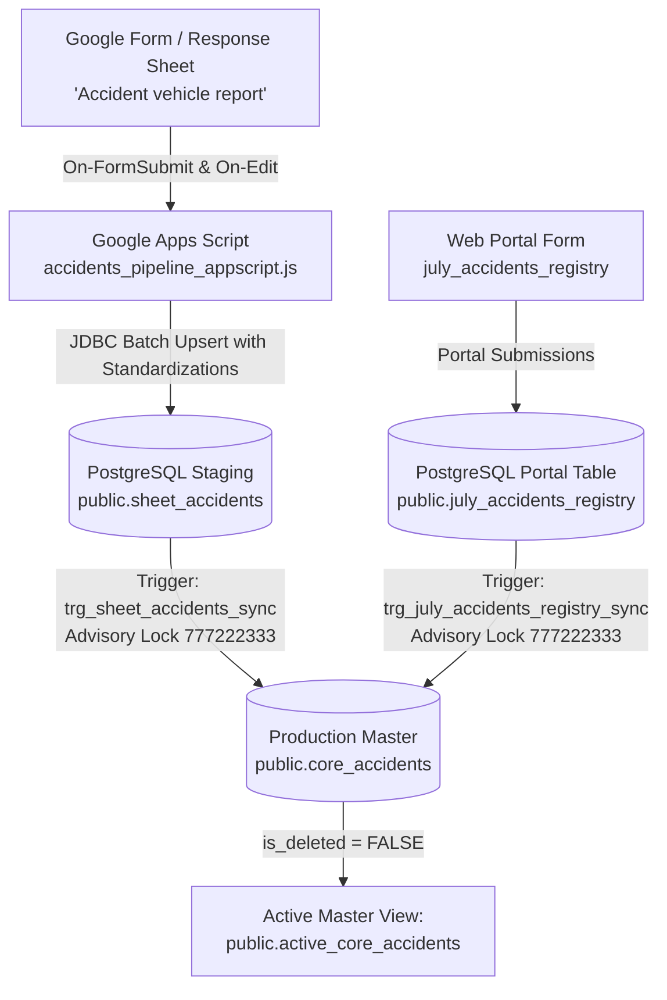

# LetzRyd Accidents Google Sheet Pipeline & PostgreSQL Master Ingestion

Real-time and batch synchronization engine bridging vehicle accident reports from Google Sheets (`Accident vehicle report` in `WIP- Pan India.xlsx`) and the web portal form (`public.july_accidents_registry`) into the centralized production PostgreSQL database (`public.core_accidents`).

---

## Architecture Overview



---

## Key Guarantees & V2 Audit Enhancements

1. **Cross-Source Deduplication & Claim Preservation**:
   - Reconciles sheet and portal submissions on matching `(vehicle_number, accident_date)`. When reports arrive from both sources for the same accident, portal inspection records overlay onto sheet claims and mark `data_source = 'MERGED'` without creating duplicate rows.
2. **Gapless Continuous Sequencing**:
   - Primary key is `id BIGINT PRIMARY KEY`. Ingestion uses transactional advisory locking (`pg_advisory_xact_lock(777222333)`) and explicit `UPDATE` for existing records, completely eliminating sequence burning.
3. **Multi-Angle Inspection Photo Preservation**:
   - Replaced single `COALESCE` with `fn_combine_portal_photos` (`CONCAT_WS(',', front, back, right, left)`), preserving all 4 inspection angles.
4. **Pure IST Timestamp Contract**:
   - Timestamps stored as `TIMESTAMP WITHOUT TIME ZONE` in Indian Standard Time (`(CURRENT_TIMESTAMP AT TIME ZONE 'Asia/Kolkata')`).
5. **Accounting Precision (0.00 vs NULL)**:
   - Financial columns (`total_invoice`, `liability_amount`, `letzryd_share`) preserve `NULL` for unassessed/unbilled claims and write `0.00` only when zero is explicitly recorded.
6. **Credential Security**:
   - Hardcoded database passwords removed in favor of `PropertiesService.getScriptProperties()`.

---

## Target Database Schema

- **Host**: `YOUR_DB_HOST_HERE:5432`
- **Database**: `postgres`
- **Staging Table**: `public.sheet_accidents`
- **Master Table**: `public.core_accidents`
- **Active Master View**: `public.active_core_accidents`
- **Consolidation Function**: `public.refresh_core_accidents()`

---

## Deployment & Verification Instructions

1. **Database DDL**: Run [`schema.sql`](./schema.sql) on the production PostgreSQL database:
   ```bash
   psql -h YOUR_DB_HOST_HERE -U postgres -d postgres -f schema.sql
   ```
2. **Apps Script Setup**:
   - Open the target Google Sheet.
   - Go to **Extensions** $\to$ **Apps Script**.
   - Navigate to **Project Settings** (⚙️) $\to$ **Script Properties** and configure `DB_HOST`, `DB_PORT`, `DB_NAME`, `DB_USER`, `DB_PASSWORD`.
   - Paste the code from [`accidents_pipeline_appscript.js`](./accidents_pipeline_appscript.js).
   - Run `setupTriggers` to register live On-Edit / Form-Submit and hourly reconciliation triggers.

3. **Verification Queries**:
   ```sql
   -- Verify source distribution
   SELECT data_source, count(*) 
   FROM public.core_accidents 
   GROUP BY data_source;

   -- Check for zero duplicate vehicle + accident date rows
   SELECT vehicle_number, accident_date, count(*)
   FROM public.core_accidents
   WHERE is_deleted = FALSE
   GROUP BY vehicle_number, accident_date
   HAVING count(*) > 1;

   -- Check gapless IDs
   SELECT count(*), max(id), max(id) - count(*) AS gap
   FROM public.core_accidents;
   ```
