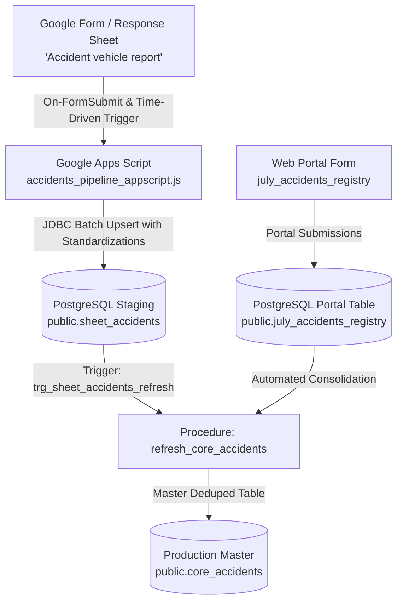

# LetzRyd Accidents Google Sheet Pipeline & PostgreSQL Master Ingestion

Real-time and batch synchronization engine bridging vehicle accident reports from Google Sheets (`Accident vehicle report` in `WIP- Pan India.xlsx`) and the web portal form (`public.july_accidents_registry`) into the centralized production PostgreSQL database (`public.core_accidents`).

---

## Architecture Overview

---

## Standardizations & Features (ACC-01 to ACC-10)

1. **Vehicle Number Sanitization (ACC-01)**: Normalizes vehicle numbers to standard uppercase alphanumeric pattern without hyphens or spaces (`MH03ES1189`).
2. **Canonical City Codes (ACC-02)**: Converts all city variations to 3-letter uppercase codes (`BLR`, `HYD`, `MUM`, `DEL`, `CHN`, `PUN`).
3. **Excel Serial Date Parsing (ACC-03)**: Automatically converts float serial dates (e.g. `45707.42965`) into ISO-8601 timestamps and dates.
4. **Police Status Consolidation (ACC-04)**: Unifies fragmented police columns (`Police Acknowledgement [Yes]`, `Police Acknowledgement [NO]`, `Police Acknowledgement`) into a single boolean `police_acknowledgement`.
5. **Driver Entity Resolution (ACC-07)**: Links vehicle allocation master history to backfill missing Partner IDs (`LETZ<CITY><PHONE>`).
6. **Financial Sanitization (ACC-06)**: Cleanses currency symbols and commas, parsing valid `NUMERIC(12,2)` amounts.
7. **Leak-Proof Resource Management**: Explicit `try-catch-finally` closing JDBC statements and connections.

---

## Target Database Schema

- **Host**: `YOUR_DB_HOST_HERE:5432`
- **Database**: `postgres`
- **Staging Table**: `public.sheet_accidents`
- **Master Table**: `public.core_accidents`
- **Consolidation Function**: `public.refresh_core_accidents()`

---

## Deployment Instructions

1. **Database DDL**: Run [`schema.sql`](./schema.sql) on the production PostgreSQL database.
2. **Apps Script Setup**:
   - Open the target Google Sheet (`WIP- Pan India` or dedicated response sheet).
   - Go to **Extensions** $\to$ **Apps Script**.
   - Paste the code from [`accidents_pipeline_appscript.js`](./accidents_pipeline_appscript.js).
   - Set up an **On Form Submit** installable trigger pointing to `handleOnFormSubmit`.
   - Set up a **Time-Driven** hourly trigger pointing to `syncAllAccidents`.
