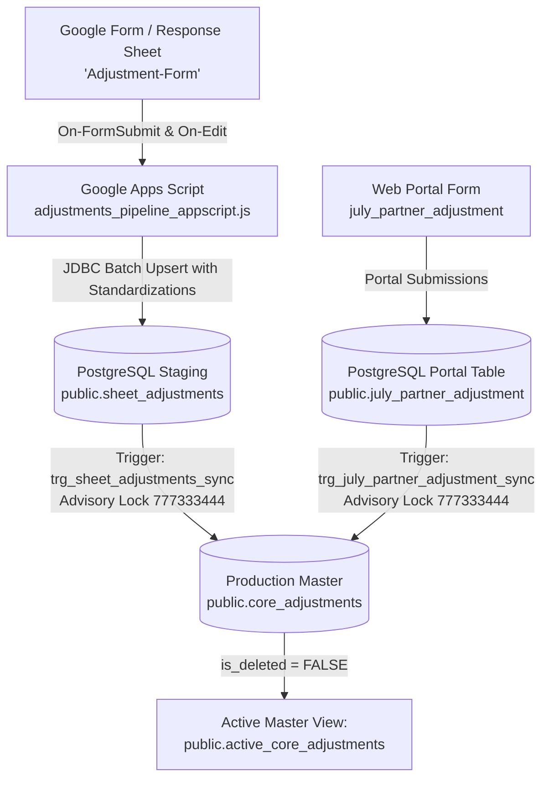

# LetzRyd Adjustments Google Sheet Pipeline & PostgreSQL Master Ingestion

Real-time and batch synchronization engine bridging partner adjustment submissions from Google Sheets (`Adjustment-Form` in `Pan India Master Sheet.xlsx`) and the web portal form (`public.july_partner_adjustment`) into the centralized production PostgreSQL database (`public.core_adjustments`).

---

## Architecture Overview



---

## Key Guarantees & V2 Audit Enhancements

1. **Cross-Source Business Key Deduplication**:
   - Reconciles adjustments across sheet and portal submissions on composite key `(partner_phone, vehicle_number, adjustment_date, amount, adjustment_type)`. When matches occur across sources, the master row is merged (`data_source = 'MERGED'`) without inflating driver Hisaab ledgers.
2. **Gapless Continuous Sequencing**:
   - Primary key defined as `id BIGINT PRIMARY KEY`. Employs transactional advisory lock `pg_advisory_xact_lock(777333444)` and explicit `UPDATE` / zero-burn inserts, completely halting the sequence burn (>13.4M IDs).
3. **NULL Phone Duplication Protection**:
   - Unique composite index `uq_sheet_adjustments_dedup` on `(submission_timestamp, COALESCE(partner_phone, 'NO_PHONE'), adjustment_date, adjustment_type)` prevents repeated script syncs from inserting duplicate NULL-phone rows.
4. **Pure IST Timestamp Contract**:
   - Timestamps stored as `TIMESTAMP WITHOUT TIME ZONE` in Indian Standard Time (`(CURRENT_TIMESTAMP AT TIME ZONE 'Asia/Kolkata')`).
5. **Multi-Level Approvals & Contested Line Items**:
   - Preserves `first_level_approver`, `final_level_approver`, `current_approver_id`, and `approved_by` across both sheet and web portal flows.
6. **Credential Security**:
   - Database credentials sanitized and retrieved via `PropertiesService.getScriptProperties()`.

---

## Target Database Schema

- **Host**: `YOUR_DB_HOST_HERE:5432`
- **Database**: `postgres`
- **Staging Table**: `public.sheet_adjustments`
- **Master Table**: `public.core_adjustments`
- **Active Master View**: `public.active_core_adjustments`
- **Consolidation Function**: `public.refresh_core_adjustments()`

---

## Deployment & Verification Instructions

1. **Database DDL & One-Time Migrations**: Run [`schema.sql`](./schema.sql) on the production PostgreSQL database:
   ```bash
   psql -h YOUR_DB_HOST_HERE -U postgres -d postgres -f schema.sql
   ```
   *Note: Section 6 of `schema.sql` automatically executes the required one-time tasks:*
   - **BIGINT Migration**: `ALTER TABLE public.sheet_adjustments ALTER COLUMN id TYPE BIGINT;`
   - **Date-Shift Duplicate Cleansing**: Deletes the 14,754 shifted Batch 1 rows (IDs $\le$ 14,838) where a matching Batch 2 row exists with the corrected IST date, restoring `public.sheet_adjustments` count from 29,620 to ~14,866 unique rows.

2. **Apps Script Setup**:
   - Open the target Google Sheet.
   - Go to **Extensions** $\to$ **Apps Script**.
   - Navigate to **Project Settings** (⚙️) $\to$ **Script Properties** and configure `DB_HOST`, `DB_PORT`, `DB_NAME`, `DB_USER`, `DB_PASSWORD`.
   - Paste the code from [`adjustments_pipeline_appscript.js`](./adjustments_pipeline_appscript.js).
   - Run `setupTriggers` to register live On-Edit / Form-Submit and 1-minute catch-up sync triggers.

3. **Verification Queries**:
   ```sql
   -- Verify sheet_adjustments count restoration (Expected: ~14,866 rows, down from 29,620)
   SELECT count(*) FROM public.sheet_adjustments;

   -- Verify 0 date-shifted duplicate pairs in sheet_adjustments
   SELECT count(*)
   FROM public.sheet_adjustments b1
   JOIN public.sheet_adjustments b2
     ON b1.submission_timestamp = b2.submission_timestamp
    AND b1.partner_phone IS NOT DISTINCT FROM b2.partner_phone
    AND b1.amount = b2.amount
    AND b1.adjustment_type = b2.adjustment_type
    AND b1.id < b2.id
    AND ABS(b1.adjustment_date - b2.adjustment_date) = 1;

   -- Verify source distribution in core master table
   SELECT data_source, count(*), sum(amount) AS total_amount
   FROM public.core_adjustments 
   GROUP BY data_source;

   -- Check for zero duplicate adjustment entries
   SELECT partner_phone, vehicle_number, adjustment_date, amount, adjustment_type, count(*)
   FROM public.core_adjustments
   WHERE is_deleted = FALSE 
     AND partner_phone IS NOT NULL AND partner_phone != ''
     AND vehicle_number IS NOT NULL AND vehicle_number != ''
   GROUP BY partner_phone, vehicle_number, adjustment_date, amount, adjustment_type
   HAVING count(*) > 1;

   -- Check gapless IDs
   SELECT count(*), max(id), max(id) - count(*) AS gap
   FROM public.core_adjustments;
   ```
