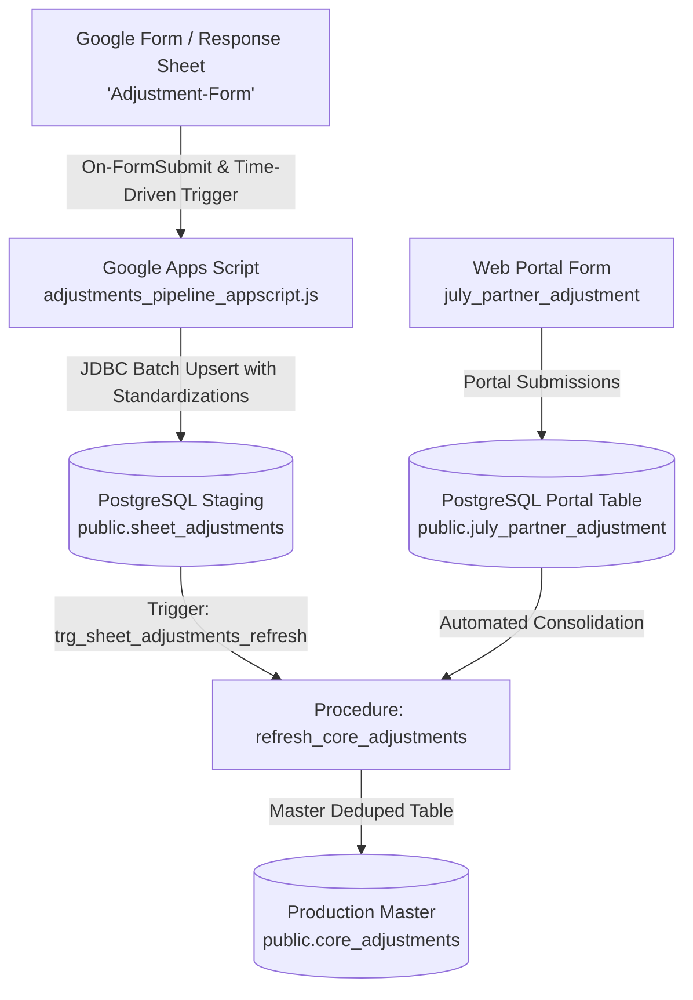

# LetzRyd Adjustments Google Sheet Pipeline & PostgreSQL Master Ingestion

Real-time and batch synchronization engine bridging partner adjustment submissions from Google Sheets (`Adjustment-Form` in `Pan India Master Sheet.xlsx`) and the web portal form (`public.july_partner_adjustment`) into the centralized production PostgreSQL database (`public.core_adjustments`).

---

## Architecture Overview

---

## Standardizations & Features (ADJ-01 to ADJ-11)

1. **City Normalization (ADJ-01)**: Normalizes city entries into standard Title Case (`Bengaluru`, `Mumbai`, `Hyderabad`, `Delhi`, `Chennai`, `Pune`).
2. **Deterministic Partner ID (ADJ-04)**: Generates canonical partner IDs (`LETZ<CITY><PHONE>`) when partner code is missing or dummy placeholder (`na`, `nan`).
3. **Phone Number Sanitization (ADJ-03)**: Normalizes floating-point numbers (`9136840411.0`), scientific notations, and truncated phone strings into clean 10-digit mobile numbers.
4. **Multi-Level Approval Resolution (ADJ-07)**: Resolves approval state contradictions using strict hierarchy (Final Level > Level 1 > Default Pending) and preserves dual audit timestamps.
5. **Excel Serial Date Parsing (ADJ-08)**: Automatically parses serial day numbers (e.g. `45705.43008`) into ISO-8601 timestamps and dates.
6. **Hisaab Week Parsing (ADJ-10)**: Extracts clean integer week numbers from free-text strings (`21. MUM Hisaab -May 19th to May 25th CY25WK21`).
7. **Portal JSON Approval Preservation (ADJ-11)**: Consolidates rich portal JSON metadata and contested line items into `public.core_adjustments`.

---

## Target Database Schema

- **Host**: `YOUR_DB_HOST_HERE:5432`
- **Database**: `postgres`
- **Staging Table**: `public.sheet_adjustments`
- **Master Table**: `public.core_adjustments`
- **Consolidation Function**: `public.refresh_core_adjustments()`

---

## Deployment Instructions

1. **Database DDL**: Run [`schema.sql`](./schema.sql) on the production PostgreSQL database.
2. **Apps Script Setup**:
   - Open the target Google Sheet (`Pan India Master Sheet` or dedicated response sheet).
   - Go to **Extensions** $\to$ **Apps Script**.
   - Paste the code from [`adjustments_pipeline_appscript.js`](./adjustments_pipeline_appscript.js).
   - Set up an **On Form Submit** installable trigger pointing to `handleOnFormSubmit`.
   - Set up a **Time-Driven** hourly trigger pointing to `syncAllAdjustments`.
