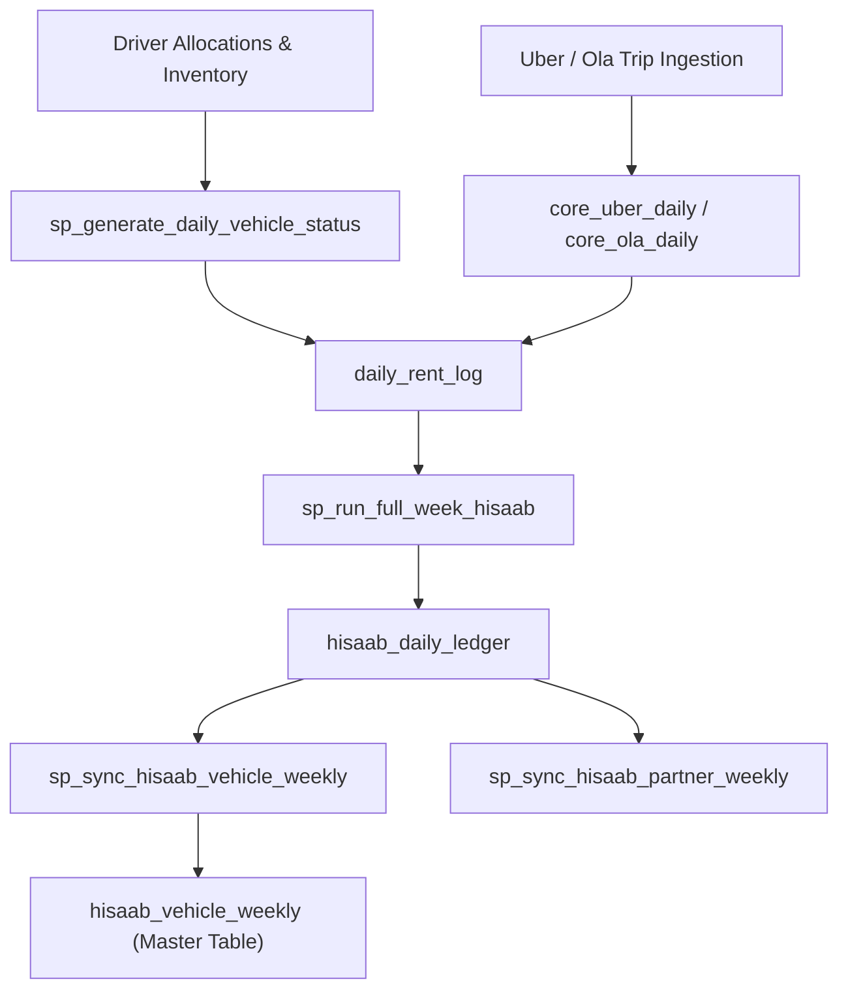

# LetzRyd Hisaab: Daily Rent Calculation & Data Architecture Knowledge Base

This document serves as the single source of truth for the **Daily Rent Calculation Engine**, detailing every operational condition, status dependency, zero-rent override, driver handover split rule, fee structure, and database pipeline procedure used across LetzRyd fleet operations in **Mumbai** and **Hyderabad**.

---

## 1. Overview & Core Architecture

The Hisaab engine automates daily and weekly rental billing for all fleet vehicles and drivers. It runs on a multi-stage data pipeline that ingests daily telematic status logs, driver allocation records, trip earnings, and contract terms from PostgreSQL into weekly financial ledgers.



---

## 2. Master Operational & Status Dependencies

Every vehicle day evaluates through a strict dependency hierarchy to determine whether rent is billable, who is billed, and what daily rate applies.

### A. Zero-Rent & Downtime Override Rules (Yard / RFD / Maintenance)
> **Crucial Rule**: Vehicles that are not actively deployed with an allocated driver must NEVER evaluate to ghost standing rent rates.

* **Status Conditions Triggering ₹0.00 Rent**:
  * `RFD` (Ready For Deployment / Sitting in Yard)
  * `Unassigned` (No active contract in `driver_vehicle_allocations`)
  * `Maintenance` (In garage for servicing)
  * `Breakdown` (Mechanical failure)
  * `Accident` (Physical damage/repair)
  * `Drop Off` / `Drop-off` (Returned by driver)
* **System Evaluation**:
  * `partner_id` is set to `''` / `NULL`.
  * `net_daily_rent` is set to **`0.00`**.
  * `is_billable_day` evaluates to **`FALSE`**.
  * `onroad_days` count evaluates to **`0`**.

### B. Partner Type Determination & Rental Plans
Partner type is derived via string pattern matching on `partner_id` with defensive fallbacks:

```sql
v_partner_type := CASE 
    WHEN partner_id ILIKE '%IP%' OR partner_id ILIKE '%OP%' THEN 'Operator' 
    ELSE 'Individual' 
END;
```

1. **Operator Fleet Contracts (`Operator` / `IP` / `OP`)**:
   * **Billable Days**: All 7 days in a settlement cycle (Monday to Sunday) are billable unless formal downtime (`Maintenance`, `Breakdown`, `Accident`) is logged.
   * **Default Flat Rent**: Standard daily rent is **₹856.00/day** (or custom rate specified in `core_rent.custom_daily_rent`).
   * **Trip Earnings**: All trips and passenger revenues belong to the vehicle's assigned operator.
2. **Individual Drivers (`Individual`)**:
   * **Trip-Based Slab (TBS) / Reducing Rent**: Daily rent tier reduces as the driver completes higher trip milestones on Uber/Ola.
   * **Off-Road Days**: Days with 0 trips and no active assignment evaluate to non-billable.

---

## 3. Handover & Mid-Week Attribution Rules

### A. Mid-Week Driver Handovers
* **Scenario**: Vehicle `MH03ES1172` is assigned to Driver A (Mon–Wed) and handed over to Driver B (Thu–Sun).
* **Attribution Rule**: `daily_rent_log` calculates and attributes revenue, rent, and dead miles strictly per composite key: `(vehicle_number, partner_id, log_date)`.
* **Rollup Mechanics**:
  * `hisaab_daily_ledger` maintains daily granularity per driver.
  * `hisaab_partner_weekly` rolls up totals per `(partner_id, week_id)`, ensuring Driver A is billed for 3 days and Driver B is billed for 4 days without cross-billing.

### B. Same-Day Drop & Allocation (Same Day D&A)
* **Scenario**: Driver A drops off a car at 10:00 AM, and Driver B is allocated the same car at 2:00 PM on the same calendar date.
* **Attribution Rule**: `sp_generate_daily_vehicle_status` uses timestamped allocation records from `driver_vehicle_allocations`. The active allocated partner at the time of operational status logging is billed for the day, preventing duplicate rent records or unassigned gaps.

---

## 4. City-Specific Fee Structures & Mandates

### A. Indemnity Fees
* **Mumbai (`city = 'Mumbai'`)**:
  * Standard daily indemnity fee of **₹30.00/day** applies to all Operator (`IP`/`OP`) and Individual vehicles.
  * Formula: $\text{DB Total Daily Fee} = \text{Net Daily Rent} + ₹30.00$.
* **Hyderabad (`city = 'Hyderabad'`)**:
  * Standard daily indemnity fee is **₹0.00/day** (unless explicitly defined in `core_rent.custom_daily_indemnity`).

### B. Dead Mile Telematics Policy
* **Mumbai**: Waived (`₹0.00`).
* **Hyderabad**: Charged at **₹3.00/km** for Individual drivers on TBS/Reducing Rent plans when $\text{total\_gps\_km} > \text{ideal\_gps\_km}$.

### C. Mandated Platform Revenue Ingestion
* **Rapido Ingestion**: Rapido revenue remains strictly **`0.00`** / empty across all database tables per business mandate.
* **Uber Master Org**: Uber vehicle incentives are scraped independently per sub-account and aggregated into `core_uber_weekly` grouped by `(UPPER(REPLACE(number_plate, ' ', '')), start_date::date)`.

---

## 5. Formula Reference & Database Pipeline Mechanics

### Daily Rent Calculation Logic (`automation_script.py` & SQL)

```python
if attendance_status in ('Maintenance', 'Breakdown', 'Accident', 'Drop Off', 'Drop-off', 'RFD', 'Unassigned') or not is_billable:
    partner_id = ''
    net_daily_rent = 0.00
    is_billable_day = False
else:
    partner_id = contract['partner_id']
    net_daily_rent = contract['custom_daily_rent'] if contract['custom_daily_rent'] > 0 else baseline_rent
    is_billable_day = True
```

### Stored Procedure Rollup Sequence

1. `sp_generate_daily_vehicle_status(target_date)`: Populates `core_daily_vehicle_status` with `RFD`, `Active`, `Maintenance`, or `Unassigned`.
2. `automation_script.py --sync-daily-status`: Ingests daily status into `daily_rent_log`, applying rent rules.
3. `sp_run_full_week_hisaab(week_id)`: Rolls up `daily_rent_log` into `hisaab_daily_ledger`.
4. `sp_sync_hisaab_vehicle_weekly(week_id)`: Computes weekly totals for `hisaab_vehicle_weekly`.
5. `sp_sync_hisaab_partner_weekly(week_id)`: Generates partner payout/collection ledgers in `hisaab_partner_weekly`.

---

## 6. Cloud Automation & Git Version Control

* **GCP Cloud Scheduler Job**: `sync-rental-sheets-30m` (Region: `asia-south1`) triggers every 30 minutes.
* **Execution**: Runs `Rental Final Table/automation_script.py` directly from GitHub `main` branch.
* **GitHub Repository**: `https://github.com/aayush-letzryd/backend.git` (Branch: `main`).
