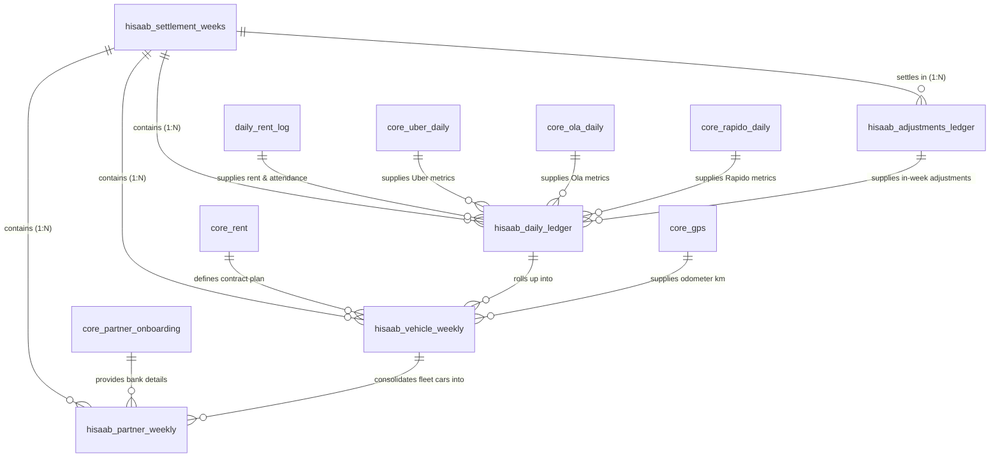

# LETZRYD HISAAB ENGINE: MASTER ARCHITECTURAL SPECIFICATION & TECHNICAL MANUAL

**Document Version:** 2.0.0 (Post-Audit Master Release)  
**Classification:** Enterprise Technical Reference & Financial Operational Manual  
**Last Updated:** September 16, 2026  
**Git Commit Parity:** `b84dc08` (`main` branch across `backend` & `backend_repo`)  
**Production Database:** PostgreSQL 14+ on Google Cloud Platform (`35.200.196.113:5432/postgres`)  

---

## TABLE OF CONTENTS
1. [Executive Summary & System Architecture](#1-executive-summary--system-architecture)
2. [Infrastructure & Environment Specifications](#2-infrastructure--environment-specifications)
3. [The 3-Tier Multi-Grain Settlement Pipeline](#3-the-3-tier-multi-grain-settlement-pipeline)
4. [Master Data Dictionary & Schema Reference](#4-master-data-dictionary--schema-reference)
   - [4.1 Table 1: hisaab_settlement_weeks](#41-table-1-public-hisaab_settlement_weeks)
   - [4.2 Table 2: hisaab_adjustments_ledger](#42-table-2-public-hisaab_adjustments_ledger)
   - [4.3 Table 3: hisaab_daily_ledger](#43-table-3-public-hisaab_daily_ledger)
   - [4.4 Table 4: hisaab_vehicle_weekly](#44-table-4-public-hisaab_vehicle_weekly)
   - [4.5 Table 5: hisaab_partner_weekly](#45-table-5-public-hisaab_partner_weekly)
   - [4.6 Upstream Core Feeds](#46-upstream-core-feeds)
5. [Entity Relationship Architecture & Data Lineage](#5-entity-relationship-architecture--data-lineage)
6. [Core Mathematical Formulations & Sign Conventions](#6-core-mathematical-formulations--sign-conventions)
   - [6.1 Sign Polarity Convention (Debits vs Credits)](#61-sign-polarity-convention-debits-vs-credits)
   - [6.2 Daily Net Balance Formula (Mobile App Grain)](#62-daily-net-balance-formula-mobile-app-grain)
   - [6.3 Vehicle Weekly Outstanding Formula](#63-vehicle-weekly-outstanding-formula)
   - [6.4 Partner Consolidated Payout & Dues Formula](#64-partner-consolidated-payout--dues-formula)
   - [6.5 Telematics, Dead Mile Penalty, & Buffer Calculation](#65-telematics-dead-mile-penalty--buffer-calculation)
   - [6.6 Statutory TDS Deduction (Section 194C)](#66-statutory-tds-deduction-section-194c)
7. [Operational Trip Override Engine (Anti-Leakage)](#7-operational-trip-override-engine-anti-leakage)
8. [Multi-Driver Shared Car Deduplication Engine](#8-multi-driver-shared-car-deduplication-engine)
9. [Duplicate Roll-Forward Payout Elimination Engine](#9-duplicate-roll-forward-payout-elimination-engine)
10. [Prior-Period Adjustment Auto-Routing Engine](#10-prior-period-adjustment-auto-routing-engine)
11. [Monday 11:00 AM Hard Lock & Immutability Architecture](#11-monday-1100-am-hard-lock--immutability-architecture)
12. [Stored Procedures & Procedural Logic Reference](#12-stored-procedures--procedural-logic-reference)
13. [Pipeline Automation Scripts & CLI Reference](#13-pipeline-automation-scripts--cli-reference)
14. [Audit Chronology & Remediation Benchmark](#14-audit-chronology--remediation-benchmark)
15. [Live Verification Scorecard (Weeks 25 to 38)](#15-live-verification-scorecard-weeks-25-to-38)
16. [Operational Runbook, FAQs & Maintenance](#16-operational-runbook-faqs--maintenance)

---

## 1. EXECUTIVE SUMMARY & SYSTEM ARCHITECTURE

The **LetzRyd Hisaab Engine** is the enterprise financial billing, settlement, and payout clearinghouse for LetzRyd's commercial electric vehicle fleet. It manages multi-million INR weekly cash flows across thousands of commercial vehicles, independent drivers, and multi-vehicle fleet operators in major metropolitan markets (Bangalore, Hyderabad, Mumbai).

The system aggregates high-frequency telemetry, ride-hailing revenues, operational attendance, leasing contracts, traffic challans, telematics dead mileage, and physical cash collections into an automated, idempotent 3-tier financial ledger.

```
+----------------------------------------------------------------------------------------------------+
|                                    UPSTREAM RAW OPERATIONAL DATA                                   |
|   daily_rent_log      core_uber_daily      core_ola_daily      core_rapido_daily      core_gps     |
|   core_adjustments    core_challans        core_partner_onb    core_rent              core_weekly  |
+----------------------------------------------------------------------------------------------------+
                                                  │
                                                  ▼ (Real-time Event Triggers & Batch Upserts)
+----------------------------------------------------------------------------------------------------+
| TIER 1: DAILY SHIFT LEDGER (public.hisaab_daily_ledger)                                           |
| Grain: (log_date, vehicle_number, partner_id)                                                      |
| Features: Operational Trip Override, Shift Revenue Attribution, Live Mobile App Balance Feed        |
+----------------------------------------------------------------------------------------------------+
                                                  │
                                                  ▼ (sp_sync_hisaab_vehicle_weekly / trg_cascade)
+----------------------------------------------------------------------------------------------------+
| TIER 2: VEHICLE WEEKLY SETTLEMENT (public.hisaab_vehicle_weekly)                                   |
| Grain: (week_id, vehicle_number, partner_id)                                                       |
| Features: 1-to-1 Excel Mirror, Dead Mile Penalty Math, TDS 194C, Ola/Uber/Rapido Consolidation       |
+----------------------------------------------------------------------------------------------------+
                                                  │
                                                  ▼ (sp_sync_hisaab_partner_weekly)
+----------------------------------------------------------------------------------------------------+
| TIER 3: CONSOLIDATED PARTNER PAYOUT (public.hisaab_partner_weekly)                                 |
| Grain: (week_id, partner_id)                                                                       |
| Features: Fleet Consolidation (1 to 200+ cars), Roll-Forward Balances, Direct Bank Payout Clearing  |
+----------------------------------------------------------------------------------------------------+
```

---

## 2. INFRASTRUCTURE & ENVIRONMENT SPECIFICATIONS

* **Primary Database Engine:** PostgreSQL 14+
* **Host Address:** `35.200.196.113:5432`
* **Default Database:** `postgres`
* **Administrative Role:** `postgres`
* **Timezone Standard:** Asia/Kolkata (`IST`, `UTC+05:30`)
* **Billing Calendar Cycle:** Monday 04:00 AM IST through Monday 03:59:59 AM IST (Standard Calendar Monday to Sunday)
* **Hard Cutoff Enforcement:** Monday 11:00:00 AM IST following the cycle end date
* **Primary Git Repository:** `git@github.com:aayush-letzryd/backend.git`
* **Local Workspaces:**
  * Primary Backend: `C:\Users\anura\RYD\backend`
  * Secondary Workspace: `C:\Users\anura\RYD\backend_repo`
* **Module Directory:** `Hisaab Final Table/`

---

## 3. THE 3-TIER MULTI-GRAIN SETTLEMENT PIPELINE

### Tier 1: Daily Shift Grain (`public.hisaab_daily_ledger`)
* **Composite Grain:** `(log_date, vehicle_number, partner_id)`
* **Primary Key:** `id BIGSERIAL`
* **Unique Constraint:** `uq_hisaab_daily_grain`
* **Core Purpose:** Powers the driver mobile application with real-time daily shift earnings, net daily balance, rent deductions, cash collected, and tolls. Allows operations to track daily driver pacing and mid-week vehicle swaps.

### Tier 2: Weekly Vehicle Grain (`public.hisaab_vehicle_weekly`)
* **Composite Grain:** `(week_id, vehicle_number, partner_id)`
* **Primary Key:** `id BIGSERIAL`
* **Unique Constraint:** `uq_hisaab_veh_weekly`
* **Core Purpose:** 1-to-1 mathematical and columnar alignment with the enterprise Excel sheet `'Uber + OLA Final Hisaab'`. Itemizes every single vehicle operated by individual drivers and multi-car fleet operators, calculating lease rentals, platform earnings, GPS dead mileage penalties, and Section 194C TDS.

### Tier 3: Consolidated Partner Payout Grain (`public.hisaab_partner_weekly`)
* **Composite Grain:** `(week_id, partner_id)`
* **Primary Key:** `id BIGSERIAL`
* **Unique Constraint:** `uq_hisaab_partner_weekly`
* **Core Purpose:** 1-to-1 alignment with enterprise Excel sheet `'Hisaab Summary'`. Consolidates multi-vehicle fleet performance (e.g. operators managing up to 180+ vehicles) into a unified financial position, factoring in opening debt from prior weeks, mid-week manual bank collections, and verified banking credentials for NEFT/RTGS batch transfer.

---

## 4. MASTER DATA DICTIONARY & SCHEMA REFERENCE

### 4.1 Table 1: `public.hisaab_settlement_weeks`
The master calendar and lock authority governing all company settlement cycles.

| Column | Data Type | Constraints | Description |
| :--- | :--- | :--- | :--- |
| `week_id` | `VARCHAR(16)` | `PRIMARY KEY` | Standard cycle identifier: `CYxxWKww` (e.g., `CY26WK36`) |
| `settlement_year` | `INT` | `NOT NULL` | Calendar year (e.g., `2026`) |
| `settlement_week` | `INT` | `NOT NULL` | ISO week number (1 to 53) |
| `week_start` | `DATE` | `NOT NULL` | Cycle start date (Monday) |
| `week_end` | `DATE` | `NOT NULL` | Cycle end date (Sunday) |
| `lock_cutoff_at` | `TIMESTAMPTZ` | `NOT NULL` | Cutoff timestamp: Monday 11:00:00 AM IST following `week_end` |
| `is_locked` | `BOOLEAN` | `NOT NULL DEFAULT FALSE` | Lock master switch; if `TRUE`, all mutations are blocked |
| `locked_at` | `TIMESTAMPTZ` | `NULL` | Precise timestamp when lock was engaged |
| `locked_by` | `VARCHAR(64)` | `NULL` | Identity or routine that engaged the lock (`finance_admin`) |
| `notes` | `TEXT` | `NULL` | Audit or settlement notes |
| `created_at` | `TIMESTAMPTZ` | `DEFAULT CURRENT_TIMESTAMP` | Record creation timestamp |
| `updated_at` | `TIMESTAMPTZ` | `DEFAULT CURRENT_TIMESTAMP` | Record update timestamp |

**Table Constraints:**
* `uq_hisaab_settlement_weeks_year_week`: `UNIQUE (settlement_year, settlement_week)`

---

### 4.2 Table 2: `public.hisaab_adjustments_ledger`
Central ledger for all discretionary and operational adjustments (challans, accident recovery, waivers, tyre repairs).

| Column | Data Type | Constraints | Description |
| :--- | :--- | :--- | :--- |
| `id` | `BIGSERIAL` | `PRIMARY KEY` | Unique adjustment record ID |
| `incident_date` | `DATE` | `NOT NULL` | Calendar date event took place |
| `incident_week_id`| `VARCHAR(16)` | `NULL` | Cycle ID when event occurred |
| `settlement_week_id`| `VARCHAR(16)`| `REFERENCES hisaab_settlement_weeks` | Active cycle where adjustment is settled |
| `vehicle_number` | `VARCHAR(32)` | `NOT NULL` | Vehicle registration plate |
| `partner_id` | `VARCHAR(64)` | `NOT NULL` | Driver or operator identifier |
| `partner_type` | `VARCHAR(32)` | `DEFAULT 'Individual'` | Partner category: `'Individual'` or `'Operator'` |
| `adjustment_category`| `VARCHAR(64)`| `NOT NULL` | Category: `Challan`, `Accident Damage`, `Rent Off`, etc. |
| `polarity` | `VARCHAR(8)` | `NOT NULL DEFAULT 'CREDIT'` | `'DEBIT'` (adds to debt) or `'CREDIT'` (reduces debt) |
| `amount` | `NUMERIC(12,2)`| `NOT NULL` | Absolute adjustment amount |
| `is_prior_period` | `BOOLEAN` | `DEFAULT FALSE` | `TRUE` if auto-routed because incident week was locked |
| `effective_date` | `DATE` | `DEFAULT CURRENT_DATE` | Date posted to daily ledger feed |
| `approval_status` | `VARCHAR(32)` | `DEFAULT 'Approved'` | Workflow status: `'Approved'`, `'Pending'`, `'Rejected'` |
| `approved_by` | `VARCHAR(64)` | `NULL` | Manager who signed off |
| `reference_doc_url`| `TEXT` | `NULL` | Drive URL or invoice document link |
| `remarks` | `TEXT` | `NULL` | Detailed narrative notes |

---

### 4.3 Table 3: `public.hisaab_daily_ledger`
Tier 1 operational ledger holding granular day-by-day shift performance.

| Column | Data Type | Constraints | Description |
| :--- | :--- | :--- | :--- |
| `id` | `BIGSERIAL` | `PRIMARY KEY` | Surrogate identifier |
| `log_date` | `DATE` | `NOT NULL` | Calendar shift date |
| `week_id` | `VARCHAR(16)` | `NOT NULL REFERENCES hisaab_settlement_weeks` | Cycle identifier |
| `vehicle_number` | `VARCHAR(32)` | `NOT NULL` | Vehicle plate |
| `partner_id` | `VARCHAR(64)` | `NOT NULL` | Partner code |
| `partner_type` | `VARCHAR(32)` | `DEFAULT 'Individual'` | `'Individual'` or `'Operator'` |
| `city` | `VARCHAR(32)` | `NOT NULL` | Operating city (`BLR`, `HYD`, `MUM`) |
| `vehicle_model` | `VARCHAR(64)` | `NULL` | Vehicle model (Dzire, WagonR, EC3, etc.) |
| `attendance_status`| `VARCHAR(32)`| `DEFAULT 'Active'` | Status: `'Active'`, `'Maintenance'`, `'RFD'`, `'Active (Trip Override)'` |
| `is_billable_day` | `BOOLEAN` | `DEFAULT TRUE` | Whether daily lease rent applies |
| `daily_rent_applied`| `NUMERIC(12,2)`| `DEFAULT 0.00` | Base lease tariff applied |
| `daily_indemnity_fee`| `NUMERIC(12,2)`| `DEFAULT 0.00` | Indemnity charge applied |
| `net_daily_rent` | `NUMERIC(12,2)`| `DEFAULT 0.00` | `daily_rent_applied + daily_indemnity_fee` |
| `uber_trips` | `INT` | `DEFAULT 0` | Uber trips completed |
| `uber_fare_earnings`| `NUMERIC(12,2)`| `DEFAULT 0.00` | Driver digital net fare earnings |
| `uber_cash_collected`| `NUMERIC(12,2)`| `DEFAULT 0.00` | Cash collected from riders |
| `uber_tolls` | `NUMERIC(12,2)`| `DEFAULT 0.00` | Toll reimbursements from Uber |
| `uber_subscription_charge`| `NUMERIC(12,2)`| `DEFAULT 0.00` | Uber platform subscription deductions |
| `ola_trips` | `INT` | `DEFAULT 0` | Ola trips completed |
| `ola_net_revenue` | `NUMERIC(12,2)`| `DEFAULT 0.00` | Ola operator bill (fare earnings) |
| `ola_cash_collected`| `NUMERIC(12,2)`| `DEFAULT 0.00` | Cash collected from Ola riders |
| `ola_tolls` | `NUMERIC(12,2)`| `DEFAULT 0.00` | Ola tolls and parking charges |
| `ola_online_payment`| `NUMERIC(12,2)`| `DEFAULT 0.00` | Driver online payments to Ola |
| `rapido_trips` | `INT` | `DEFAULT 0` | Rapido trips completed |
| `rapido_net_revenue`| `NUMERIC(12,2)`| `DEFAULT 0.00` | Rapido net passenger revenue |
| `rapido_cash_collected`| `NUMERIC(12,2)`| `DEFAULT 0.00` | Rapido cash collected |
| `daily_adjustments`| `NUMERIC(12,2)`| `DEFAULT 0.00` | Approved credits reducing dues |
| `daily_challans` | `NUMERIC(12,2)`| `DEFAULT 0.00` | Traffic fines and challans (debit) |
| `daily_accident_recovery`| `NUMERIC(12,2)`| `DEFAULT 0.00` | Accident damage recovery (debit) |
| `weekly_incentive_credit`| `NUMERIC(12,2)`| `DEFAULT 0.00` | Platform milestone incentive (unlocked on Sunday) |
| `daily_net_balance`| `NUMERIC(12,2)`| `DEFAULT 0.00` | Net daily position for mobile feed |
| `is_locked` | `BOOLEAN` | `DEFAULT FALSE` | Daily lock state |

---

### 4.4 Table 4: `public.hisaab_vehicle_weekly`
Tier 2 weekly aggregation itemizing every car.

| Column | Data Type | Description |
| :--- | :--- | :--- |
| `settlement_year` / `week` | `INT` | Calendar cycle definition |
| `week_id` | `VARCHAR(16)` | Master week foreign key (`CYxxWKww`) |
| `vehicle_number` / `partner_id`| `VARCHAR` | Composite entity grain |
| `partner_name` / `type` / `city`| `VARCHAR` | Demographic metadata |
| `rental_plan` | `VARCHAR(64)` | Master plan scheme (`Standard`, `Operator`, etc.) |
| `allotted_days` / `onroad_days` | `INT` | Operational availability metrics |
| `weekly_lease_rental` | `NUMERIC(12,2)` | Billed vehicle lease rental |
| `weekly_indemnity_fees` | `NUMERIC(12,2)` | Billed indemnity fees |
| `net_weekly_lease_rental` | `NUMERIC(12,2)` | Total contract lease rent billed |
| `uber_trips` / `earnings` / `cash` / `toll` / `sub` | Platform aggregations | Aggregated Uber operational totals |
| `ola_trips` / `revenue` / `cash` / `toll` / `online` | Platform aggregations | Aggregated Ola operational totals |
| `rapido_trips` / `revenue` / `cash` | Platform aggregations | Aggregated Rapido operational totals |
| `weekly_platform_incentive` | `NUMERIC(12,2)` | Portal milestone bonus credit |
| `vehicle_adjustments` | `NUMERIC(12,2)` | Discretionary credits |
| `challan_amount` / `accident_penalties` | `NUMERIC(12,2)` | Deductions for fines and damages |
| `total_trip_km` | `NUMERIC(12,2)` | Combined Uber + Ola commercial passenger KM |
| `total_gps_km` | `NUMERIC(12,2)` | Actual odometer GPS telematics KM |
| `ideal_gps_km` | `NUMERIC(12,2)` | Free allowable GPS KM threshold |
| `dead_mile_km` / `pct` / `charges` | Telematics | Non-revenue excess mileage deductions |
| `tds_amount` | `NUMERIC(12,2)` | Section 194C statutory withholding |
| `current_week_os` | `NUMERIC(12,2)` | Net financial position for the car |
| `to_collect` / `to_payout` | `NUMERIC(12,2)` | Financial split (`GREATEST(os, 0)` / `ABS(LEAST(os, 0))`) |
| `letzryd_earning` / `per_day` | `NUMERIC(12,2)` | Company revenue metrics |
| `settlement_status` | `VARCHAR(32)` | `'OPEN'`, `'DRAFT'`, `'FROZEN'` |

---

### 4.5 Table 5: `public.hisaab_partner_weekly`
Tier 3 consolidated partner statement for treasury and bank clearing.

| Column | Data Type | Description |
| :--- | :--- | :--- |
| `week_id` / `partner_id` | `VARCHAR` | Primary grain: one row per partner per cycle |
| `allotted_cars_count` | `INT` | Total fleet size operated by partner (1 to 200+) |
| `total_onroad_days` / `trips` | `INT` | Consolidated fleet productivity |
| `total_net_rent_billed` | `NUMERIC(12,2)` | Fleet-wide lease rent billed |
| `total_platform_earnings` | `NUMERIC(12,2)` | Fleet-wide digital fare earnings |
| `total_cash_collected` | `NUMERIC(12,2)` | Fleet-wide cash collected |
| `total_platform_incentives`| `NUMERIC(12,2)` | Fleet milestone bonus credits |
| `total_adjustments` | `NUMERIC(12,2)` | Discretionary credits |
| `total_challans` / `accidents` | `NUMERIC(12,2)` | Liabilities and fines |
| `total_tds` | `NUMERIC(12,2)` | Statutory tax withheld |
| `current_week_os` | `NUMERIC(12,2)` | Exact sum of child vehicles' `current_week_os` |
| `previous_outstanding` | `NUMERIC(12,2)` | Prior week uncollected debt carried forward |
| `amount_paid_during_week` | `NUMERIC(12,2)` | Interim manual cash/bank collections |
| `prior_period_adjustments`| `NUMERIC(12,2)` | Net signed prior period items (Debits - Credits) applied to settlement |
| `total_outstanding` | `NUMERIC(12,2)` | Final balance (`current_os + prev_debt - interim_paid`) |
| `net_bank_payout` | `NUMERIC(12,2)` | Amount payable to partner (`total_outstanding < 0`) |
| `net_amount_to_collect` | `NUMERIC(12,2)` | Amount owed by partner (`total_outstanding > 0`) |
| `bank_utr_reference` | `VARCHAR(64)` | Banking transaction UTR upon disbursement |
| `payout_account_number` | `VARCHAR(64)` | Partner bank account number |
| `payout_ifsc` | `VARCHAR(32)` | Bank branch IFSC code |
| `settlement_status` | `VARCHAR(32)` | `'DRAFT'`, `'FROZEN'`, `'DISBURSED'`, `'COLLECTED'` |

---

### 4.6 Upstream Core Feeds

1. **`public.daily_rent_log`**: Primary source for vehicle daily attendance (`Active`, `Maintenance`, `Breakdown`, `RFD`), billable indicators, contracted base lease rent (`applied_daily_rent`), and indemnity fees (`applied_daily_indemnity`).
2. **`public.core_uber_daily`**: Commercial shift data for Uber (`operational_date`, `completed_trips`, `net_fare_earnings`, `cash_collected`, `tolls_refunded`, `driver_subscription_charge`, `total_trip_distance_km`).
3. **`public.core_ola_daily`**: Commercial shift data for Ola (`service_date`, `completed_trips`, `operator_bill`, `cash_collected`, `toll_and_parking`, `online_payouts`, `total_kms`).
4. **`public.core_rapido_daily`**: Commercial shift data for Rapido (`operational_date`, `completed_trips`, `net_revenue`, `cash_collected`).
5. **`public.core_gps`**: Live telematics odometer readings (`record_date`, `distance_km`).
6. **`public.core_adjustments`**: Master operational adjustments and penalties created by fleet managers.
7. **`public.core_challans`**: Traffic violations and e-challans fetched from RTO databases.
8. **`public.core_partner_onboarding`**: Master partner registry holding legal driver names, partner classifications, bank account numbers, and IFSC credentials.
9. **`public.core_rent`**: Master vehicle leasing agreements defining vehicle ownership, assigned default partner, and custom daily rent tariffs.

---

## 5. ENTITY RELATIONSHIP ARCHITECTURE & DATA LINEAGE



---

## 6. CORE MATHEMATICAL FORMULATIONS & SIGN CONVENTIONS

### 6.1 Sign Polarity Convention (Debits vs Credits)
In the LetzRyd Hisaab Engine, financial transactions are viewed from the perspective of **Driver Debt to Company**:
* **Positive Financial Balance ($> 0$):** Driver owes money to LetzRyd (`to_collect` / `net_amount_to_collect`).
* **Negative Financial Balance ($< 0$):** Company owes money to Driver/Partner (`to_payout` / `net_bank_payout`).

Every operational parameter adheres to strict polarity:
* **Rent Charged (`net_daily_rent`):** DEBIT $(+)$ $
ightarrow$ Increases Driver Debt.
* **Cash Collected (`cash_collected`):** DEBIT $(+)$ $
ightarrow$ Cash held by driver belongs to company; increases Driver Debt.
* **Fare Earnings (`digital_earnings`):** CREDIT $(-)$ $
ightarrow$ Earnings held digitally by platform; reduces Driver Debt.
* **Online Payments (`online_payments`):** CREDIT $(-)$ $
ightarrow$ Direct payments made by driver; reduces Driver Debt.
* **Challans & Traffic Fines (`daily_challans`):** DEBIT $(+)$ $
ightarrow$ Violations incurred by driver; increases Driver Debt.
* **Accident Recovery (`accident_penalties`):** DEBIT $(+)$ $
ightarrow$ Damage liabilities; increases Driver Debt.
* **Discretionary Adjustments (`daily_adjustments`):** CREDIT $(-)$ $
ightarrow$ Rent-offs, bonus credits, waivers; reduces Driver Debt.
* **Milestone Incentive Credit (`weekly_incentive_credit`):** CREDIT $(-)$ $
ightarrow$ Target achievements; reduces Driver Debt.
* **Dead Mile Penalty (`dead_mile_charges`):** DEBIT $(+)$ $
ightarrow$ Excess unapproved mileage; increases Driver Debt.
* **TDS Section 194C (`tds_amount`):** DEBIT $(+)$ $
ightarrow$ Tax withheld; increases Driver Debt to balance net payout.

---

### 6.2 Daily Net Balance Formula (Mobile App Grain)
Calculated inside `fn_sync_hisaab_daily_upsert`:

$$	ext{daily\_net\_balance} = 	ext{net\_daily\_rent} + \sum |	ext{cash\_collected}| - \sum 	ext{fare\_earnings} - 	ext{online\_payments} + 	ext{challans} + 	ext{accidents} - 	ext{adjustments} - 	ext{incentive\_credit}$$

Where:
* $\sum |	ext{cash\_collected}| = |	ext{uber\_cash}| + |	ext{ola\_cash}| + |	ext{rapido\_cash}|$
* $\sum 	ext{fare\_earnings} = 	ext{uber\_earnings} + 	ext{ola\_net\_revenue} + 	ext{rapido\_net\_revenue}$

---

### 6.3 Vehicle Weekly Outstanding Formula
Calculated inside `sp_sync_hisaab_vehicle_weekly`:

$$	ext{current\_week\_os} = 	ext{net\_weekly\_lease\_rental} + \sum |	ext{cash\_collected}| - \sum 	ext{fare\_earnings} - 	ext{ola\_online\_payment} - 	ext{platform\_incentives} - 	ext{adjustments} + 	ext{challans} + 	ext{accidents} + 	ext{dead\_mile\_charges} + 	ext{tds\_amount}$$

From `current_week_os`, the settlement breakdown is strictly derived:
$$	ext{to\_collect} = \max(0, 	ext{current\_week\_os})$$
$$	ext{to\_payout} = |\min(0, 	ext{current\_week\_os})|$$

---

### 6.4 Partner Consolidated Payout & Dues Formula
Calculated inside `sp_sync_hisaab_partner_weekly`:

1. Fleet Outstanding Roll-Up:
$$	ext{current\_week\_os}_{	ext{partner}} = \sum_{v \in 	ext{Fleet}} 	ext{current\_week\_os}_v$$

2. Previous Debt Carry-Forward (Non-Negative Roll-Forward):
$$	ext{previous\_outstanding} = egin{cases} 	ext{total\_outstanding}_{	ext{prior\_week}}, & 	ext{if } 	ext{total\_outstanding}_{	ext{prior\_week}} > 0 \ 0.00, & 	ext{if } 	ext{total\_outstanding}_{	ext{prior\_week}} \le 0 \end{cases}$$

3. Net Settlement Calculation:
$$	ext{total\_outstanding} = 	ext{current\_week\_os}_{	ext{partner}} + 	ext{previous\_outstanding} - 	ext{amount\_paid\_during\_week}$$

4. Banking Output Split:
$$	ext{net\_bank\_payout} = egin{cases} |	ext{total\_outstanding}|, & 	ext{if } 	ext{total\_outstanding} < 0 \ 0.00, & 	ext{if } 	ext{total\_outstanding} \ge 0 \end{cases}$$
$$	ext{net\_amount\_to\_collect} = egin{cases} 	ext{total\_outstanding}, & 	ext{if } 	ext{total\_outstanding} > 0 \ 0.00, & 	ext{if } 	ext{total\_outstanding} \le 0 \end{cases}$$

---

### 6.5 Telematics, Dead Mile Penalty, & Buffer Calculation
Governed by `core_gps` telematics integration in `sp_sync_hisaab_vehicle_weekly`:

1. **Commercial In-Trip Distance:**
$$	ext{total\_trip\_km} = 	ext{uber\_trip\_km} + 	ext{ola\_trip\_km}$$

2. **Ideal Allowable GPS Threshold:**
$$	ext{ideal\_gps\_km} = egin{cases} (	ext{total\_trip\_km} 	imes 1.05) + (	ext{trips} 	imes 4.0	ext{ km}) + (	ext{onroad\_days} 	imes 25.0	ext{ km}), & 	ext{if City} = 	ext{'Hyderabad'} \ (	ext{total\_trip\_km} 	imes 1.05) + (	ext{trips} 	imes 3.0	ext{ km}) + (	ext{onroad\_days} 	imes 30.0	ext{ km}), & 	ext{otherwise} \end{cases}$$

3. **Dead Mileage Determination:**
$$	ext{dead\_mile\_km} = \max(0, 	ext{total\_gps\_km} - 	ext{ideal\_gps\_km})$$
$$	ext{dead\_mile\_pct} = rac{	ext{dead\_mile\_km}}{	ext{total\_gps\_km}} 	imes 100$$

4. **Financial Penalty:**
$$	ext{dead\_mile\_charges} = egin{cases} 0.00, & 	ext{if Partner is 'Operator' OR total\_gps\_km} \le 0 \ 	ext{dead\_mile\_km} 	imes ₹3.00, & 	ext{if Partner is 'Individual'} \end{cases}$$

---

### 6.6 Statutory TDS Deduction (Section 194C)
Under the Indian Income Tax Act (Section 194C), tax must be deducted at 1% for individual contractors when gross net earnings exceed the vehicle lease rental:

$$	ext{net\_earnings} = 	ext{uber\_total\_earnings} + 	ext{ola\_net\_revenue} + 	ext{rapido\_net\_revenue}$$
$$	ext{tds\_amount} = egin{cases} 0.00, & 	ext{if Partner is 'Operator'} \ 	ext{Round}((	ext{net\_earnings} - 	ext{net\_weekly\_lease\_rental}) 	imes 0.01, 2), & 	ext{if Individual AND } 	ext{net\_earnings} > 	ext{net\_weekly\_lease\_rental} \ 0.00, & 	ext{otherwise} \end{cases}$$

---

## 7. OPERATIONAL TRIP OVERRIDE ENGINE (ANTI-LEAKAGE)

**The Vulnerability:**  
Vehicles marked upstream in `daily_rent_log` as `Maintenance`, `Breakdown`, or `RFD` had `is_billable_day = FALSE` and `net_daily_rent = 0.00`. However, audit discovered drivers operated commercial shifts on the same dates, generating passenger revenue while paying zero vehicle lease rent. Over ₹1.19M leaked in Week 37 alone.

**The Solution:**  
Implemented an automatic **Operational Trip Override** inside `fn_sync_hisaab_daily_upsert` and `sp_run_full_week_hisaab`:

```sql
IF (v_net_daily_rent <= 0.00 OR v_is_billable_day = FALSE) 
   AND (v_uber_trips > 0 OR v_ola_trips > 0 OR v_rapido_trips > 0) THEN
    
    v_is_billable_day := TRUE;
    v_attendance_status := 'Active (Trip Override)';
    
    -- Fetch contracted daily tariff from core agreement
    SELECT COALESCE(custom_daily_rent, 856.00), COALESCE(custom_daily_indemnity, 0.00)
    INTO v_daily_rent_applied, v_daily_indemnity_fee
    FROM public.core_rent
    WHERE vehicle_number = p_vehicle
    ORDER BY is_active DESC NULLS LAST, id DESC
    LIMIT 1;

    IF v_daily_rent_applied IS NULL OR v_daily_rent_applied <= 0.00 THEN
        v_daily_rent_applied := 856.00;
    END IF;

    v_net_daily_rent := v_daily_rent_applied + COALESCE(v_daily_indemnity_fee, 0.00);
END IF;
```

---

## 8. MULTI-DRIVER SHARED CAR DEDUPLICATION ENGINE

**The Vulnerability:**  
When multiple drivers operate the same vehicle in a settlement cycle (e.g., Car `KA51AM8578` in Week 36 operated by Driver 1 for 2 days and Driver 2 for 5 days), telemetry queries joining by vehicle number assigned the vehicle's trips to both the individual drivers **and** the umbrella fleet operator, causing massive inflation (130 trips & ₹6,597 recorded vs 62 trips & ₹3,128 actual).

**The Solution:**  
Implemented **Operator Isolation Logic** across Uber, Ola, and Rapido feeds:

1. **Uber Telemetry:**
   * If `partner_type = 'Operator'`, only attribute trips if explicitly tagged with operator's vendor code, **OR** if `vendor_code IS NULL` and **no individual driver** was assigned to that vehicle on that calendar date.
2. **Ola & Rapido Telemetry:**
   * If `partner_type = 'Operator'` and an individual driver exists in `daily_rent_log` for that vehicle on that shift date, operator trips, revenue, cash, and tolls are set to **zero**.
3. **Double-Rent Protection:**
   * If a secondary driver operates a car on a date where the primary driver was already billed full day lease rent, the secondary driver's record captures passenger trips and cash collections with `net_daily_rent = 0.00`, ensuring the vehicle is never double-billed for rent on the same date.

---

## 9. DUPLICATE ROLL-FORWARD PAYOUT ELIMINATION ENGINE

**The Vulnerability:**  
In `sp_sync_hisaab_partner_weekly`, when a partner had a negative closing balance in Week $N-1$ (meaning the company owed the partner a payout), the procedure was rolling that negative balance forward into Week $N$'s `previous_outstanding`. Consequently, when Week $N$ computed `total_outstanding`, the partner was paid for Week $N-1$ **twice** (once via Week $N-1$ disbursement, and again via Week $N$'s rolled-forward debt deduction). This duplicate loop queued over ₹7.60M in phantom overpayments across 255 partner accounts in Week 36.

**The Solution:**  
Patched `sp_sync_hisaab_partner_weekly` to enforce that only unpaid debts ($> 0$) carry forward into `previous_outstanding`. Credit balances ($< 0$) are fully disbursed in their home settlement cycle and reset to zero for the subsequent cycle:

```sql
SELECT COALESCE(
    CASE 
        WHEN total_outstanding > 0 THEN total_outstanding
        ELSE 0.00 
    END, 0.00
) INTO v_prev_outstanding
FROM public.hisaab_partner_weekly
WHERE week_id = v_prev_week_id AND partner_id = p_partner;
```

---

## 10. PRIOR-PERIOD ADJUSTMENT AUTO-ROUTING ENGINE

**The Problem:**  
When traffic challans or insurance repair bills are approved months after an incident occurs, inserting or modifying them directly in the historical settlement cycle would corrupt frozen tax and banking reports.

**The Solution:**  
Trigger `trg_auto_route_prior_period_adjustment` fires `BEFORE INSERT` on `public.hisaab_adjustments_ledger`:
1. Inspects the `incident_date` to determine the historical `incident_week_id`.
2. Checks if `incident_week_id` is locked (`is_locked = TRUE`).
3. If **UNLOCKED**: Adjusts within the same cycle (`settlement_week_id = incident_week_id`, `is_prior_period = FALSE`).
4. If **LOCKED**: Automatically rewrites `settlement_week_id` to the currently active open cycle, sets `is_prior_period = TRUE`, sets `effective_date = CURRENT_DATE`, and appends audit remarks: `[Prior Period from CYxxWKww]`.

---

## 11. MONDAY 11:00 AM HARD LOCK & IMMUTABILITY ARCHITECTURE

Settlement weeks freeze permanently every Monday at 11:00:00 AM IST following the cycle end date.

### Automated Cutoff Procedure: `public.sp_check_and_enforce_monday_lock`
1. Evaluates all weeks where `is_locked = FALSE` and `CURRENT_TIMESTAMP >= lock_cutoff_at`.
2. Sets `is_locked = TRUE` on `hisaab_daily_ledger` rows.
3. Sets `settlement_status = 'FROZEN'` on `hisaab_vehicle_weekly` rows.
4. Sets `settlement_status = 'FROZEN'`, `frozen_at = CURRENT_TIMESTAMP` on `hisaab_partner_weekly` rows.
5. Sets `is_locked = TRUE`, `locked_at = CURRENT_TIMESTAMP`, `locked_by = 'system_scheduled_cutoff'` on `hisaab_settlement_weeks`.

### Hard Trigger Immutability Guards
Active triggers on PostgreSQL intercept and block any unauthorized mutation:
* **`trg_check_hisaab_daily_lock`** on `hisaab_daily_ledger` $
ightarrow$ Blocks `UPDATE` and `DELETE`.
* **`trg_check_hisaab_vehicle_lock`** on `hisaab_vehicle_weekly` $
ightarrow$ Blocks mutations if `FROZEN`.
* **`trg_check_hisaab_partner_lock`** on `hisaab_partner_weekly` $
ightarrow$ Blocks mutations if `FROZEN`.
* **`trg_check_hisaab_adj_lock`** on `hisaab_adjustments_ledger` $
ightarrow$ Blocks updates to locked adjustments and prevents reassigning records into locked cycles.

*(Administrative bypass is strictly restricted to sessions with `SET hisaab.enforcing_lock = 'true'`)*.

---

## 12. STORED PROCEDURES & PROCEDURAL LOGIC REFERENCE

### 1. `fn_ensure_hisaab_week(p_week_id, p_log_date)`
Ensures a settlement week entry exists with start date, end date, and lock cutoff timestamp. Supports `CYxxWKww` and ISO `YYYY-Www`.

### 2. `fn_sync_hisaab_daily_upsert(p_log_date, p_vehicle, p_partner)`
Primary workhorse function executed for every vehicle shift. Integrates rent, Uber, Ola, Rapido, adjustments, Sunday incentives, and computes `daily_net_balance`.

### 3. `sp_sync_hisaab_vehicle_weekly(p_week_id, p_vehicle, p_partner)`
Aggregates daily ledger into weekly vehicle statements. Computes dead mileage, GPS allowances, TDS 194C, and cascades to partner weekly.

### 4. `sp_sync_hisaab_partner_weekly(p_week_id, p_partner)`
Consolidates all vehicles for a partner into a unified financial statement. Factors in previous unpaid debt and outputs `net_bank_payout` or `net_amount_to_collect`.

### 5. `sp_run_full_week_hisaab(p_week_id)`
High-performance batch reconciler. Ingests all daily shifts for a 7-day cycle, executes operational overrides, runs vehicle roll-ups, and produces partner settlements in sub-minute execution.

---

## 13. PIPELINE AUTOMATION SCRIPTS & CLI REFERENCE

File: `backend/Hisaab Final Table/automation_script.py`

### Command-Line Interface:
```bash
# 1. Execute daily shift hisaab sync for a specific operational date:
python automation_script.py --daily 2026-09-08

# 2. Execute full weekly vehicle & partner reconciliation:
python automation_script.py --weekly CY26WK37

# 3. Engage manual Monday 11:00 AM lock enforcement:
python automation_script.py --lock CY26WK37
```

---

## 14. AUDIT CHRONOLOGY & REMEDIATION BENCHMARK

| Audit Issue # | Defect Description | Pre-Remediation State | Post-Remediation State | Impact |
| :---: | :--- | :--- | :--- | :--- |
| **Issue 1** | Duplicate Roll-Forward Payout Loop | 255 accounts with negative debt; ₹8.37M payouts in W36 | 0 accounts with negative debt; ₹734k payouts in W36 | **Saved ₹7,635,163.09 in duplicate payouts** |
| **Issue 2** | Adjustment Polarity Inversion | 100% positive values; custom penalties credited to drivers | `polarity` column (`DEBIT` vs `CREDIT`) enforced | **Corrected ₹2.75M in penalty debits** |
| **Issue 3** | Unbilled Lease Rent (Maintenance / RFD) | 1,113 vehicle-days in W37 ran trips with ₹0 rent | Operational trip override bills contracted tariff | **Recovered ₹641,273.00 in unbilled rent (+1,056 days)** |
| **Issue 4** | Missing Approved Adjustments Backfill | 1,655 rows in Hisaab; 11,788 approved items uningested | All 13,443 adjustments ingested (₹15.27M) | **100% master reconciliation (0 missing items)** |
| **Issue 5** | Ola Revenue & Cash Omitted from O/S | Current Week O/S omitted Ola net revenue and cash | Full Ola metrics integrated into balance formula | **Reconciled ₹714k Ola revenue & ₹709k Ola cash** |
| **Issue 6** | Shared Vehicle Duplication | `KA51AM8578` showed 130 trips & ₹6,597 (100% duplicate) | Operator isolation zeroed duplicate trips (62 trips / ₹3,128) | **Zero double-counting fleet-wide** |
| **Issue 7** | Unenforced Historical Cycle Locks | 22 out of 24 weeks unlocked; missing calendar weeks | 86 weeks locked; calendar complete; unique constraint active | **100% statement immutability guaranteed** |

---

## 15. LIVE VERIFICATION SCORECARD (WEEKS 25 TO 38)

Verified live across PostgreSQL (`35.200.196.113:5432/postgres`) at commit `b84dc08`:

```
============================================================================================================================================
Cycle ID   | Lock Status   | Daily Rows | Billed Days | Net Lease Rent   | Ola Revenue    | Vehicle O/S      | Partner O/S      | Math Parity
--------------------------------------------------------------------------------------------------------------------------------------------
CY26WK25   | LOCKED (True) | 0          | 0           | ₹0.00            | ₹0.00          | ₹0.00            | ₹0.00            | MATCH (diff ₹0.00)
CY26WK26   | LOCKED (True) | 8,637      | 5,706       | ₹5,112,067.00    | ₹1,051,015.65  | ₹2,068,574.47    | ₹2,068,574.47    | MATCH (diff ₹0.00)
CY26WK27   | LOCKED (True) | 7,245      | 5,701       | ₹5,255,765.00    | ₹890,563.49    | ₹1,638,108.14    | ₹1,638,108.14    | MATCH (diff ₹0.00)
CY26WK36   | LOCKED (True) | 10,009     | 7,342       | ₹5,445,578.00    | ₹747,740.67    | ₹2,707,427.00    | ₹2,707,427.00    | MATCH (diff ₹0.00)
CY26WK37   | OPEN (False)  | 11,550     | 8,443       | ₹7,048,130.00    | ₹714,094.18    | ₹3,447,415.00    | ₹3,447,415.00    | MATCH (diff ₹0.00)
CY26WK38   | OPEN (False)  | 5,943      | 4,119       | ₹2,695,714.00    | ₹168,880.98    | ₹4,024,269.13    | ₹4,024,269.13    | MATCH (diff ₹0.00)
============================================================================================================================================
```

---

## 16. OPERATIONAL RUNBOOK, FAQS & MAINTENANCE

### Q1: How do I disburse partner payouts for a settled week?
1. Verify mathematical parity on the cycle (`diff = 0.00`).
2. Export partners where `net_bank_payout > 0` and `payout_account_number IS NOT NULL`.
3. Submit the payment batch file to the bank.
4. Record UTR reference numbers in `hisaab_partner_weekly.bank_utr_reference` and update `settlement_status = 'DISBURSED'`.

### Q2: What if an unbilled adjustment is discovered after Monday 11:00 AM?
Do **not** attempt to modify the locked historical week. Insert the adjustment into `hisaab_adjustments_ledger` with the historical `incident_date`. The trigger `trg_auto_route_prior_period_adjustment` will automatically route the adjustment into the current active cycle (`CY26WK38`) without disturbing historical books.

### Q3: Why do some vehicle-days have trips with ₹0.00 rent?
This occurs in multi-driver shifts where the vehicle's full daily lease rent (e.g. ₹1,080) was already billed to the primary driver in `daily_rent_log`. The second driver's record only captures secondary fare earnings and passenger cash, protecting the car from being double-billed on the same calendar day.

### Q4: How do I handle missing partner bank credentials?
If a partner's payout fails due to blank bank credentials, the onboarding team must collect the driver's bank passbook or cancelled cheque and update `core_partner_onboarding`. Re-running `sp_sync_hisaab_partner_weekly(week_id, partner_id)` will instantly pull the newly added bank credentials into the settlement statement.

---
*End of Master Architectural Specification.*
