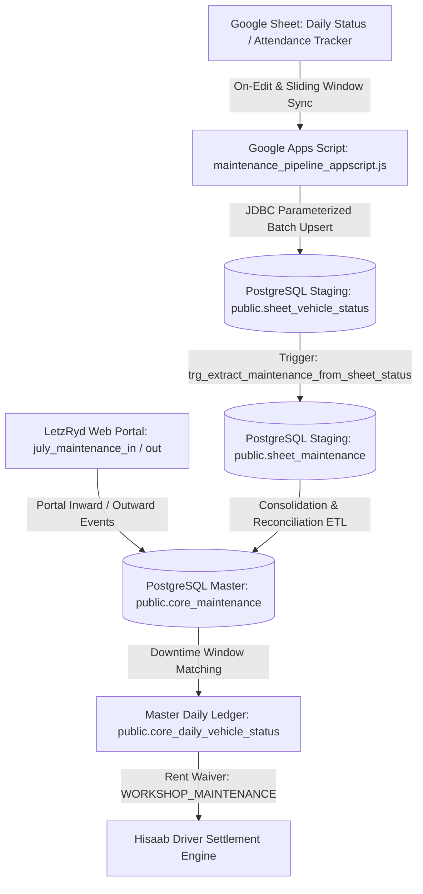

# LetzRyd Fleet Maintenance Pipeline - Architecture & Knowledge Transfer (KT)

Real-time and batch synchronization engine that isolates, standardizes, and extracts vehicle maintenance downtime records from the operational daily vehicle status sheet (`public.sheet_vehicle_status`) into the dedicated maintenance staging table (`public.sheet_maintenance`) and downstream master tables (`public.core_maintenance`).

---

## 1. Architectural Rationale: Why Split Maintenance from General Attendance?

In LetzRyd fleet operations, vehicle status tracking operates across two distinct conceptual planes:
1. **Continuous Daily Attendance (Monolithic Ledger)**: Tracks every vehicle in the 1,623+ active fleet across every calendar date (e.g. Active with Driver, RFD in Hub Yard, or Off Road). This produces over 50,000 records per month.
2. **Maintenance Downtime Events (Exception Lifecycle)**: Represents specific physical workshop, breakdown, or accidental repair intervals where an asset cannot generate revenue.

### Operational Problems of Monolithic Attendance Storage

- **Data Bloat & Index Saturation**: Querying maintenance downtime across hundreds of thousands of active driver attendance rows creates unnecessary query latency for workshop coordination and fleet health dashboards.
- **Workshop Vendor & SLA Obscurity**: External garage partners (Carnation, Castrol, Bosch, authorized dealer workshops) require dedicated job card tracking, parts invoice matching, and Turnaround Time (TAT) metrics. Mixing these operational attributes into a generic attendance sheet results in high null rates and unstructured remarks.
- **Hisaab Settlement Disputes (Rent Waivers)**: Driver rental billing in LetzRyd Hisaab engine operates on daily accrual. If a car is in the workshop, driver rent must be systematically paused or waived (`rent_waived_reason = 'WORKSHOP_MAINTENANCE'`). Conflating attendance rows with maintenance records risks erroneous rent deductions or duplicate billing chargebacks.
- **IP Operator Contractual Retention**: Institutional Partner (IP) fleet operators retain administrative vehicle assignments even during repairs, whereas individual drivers are unassigned. A dedicated staging table isolates this business logic without altering raw driver attendance records.

### The Decoupled Architecture



---

## 2. Target Database Schema & Data Dictionary

### Table: `public.sheet_maintenance`

| Column Name | Data Type | Nullable | Default | Description |
| :--- | :--- | :--- | :--- | :--- |
| `id` | `BIGSERIAL` | No | `nextval(...)` | Synthetic primary key for internal record tracking. |
| `vehicle_number` | `VARCHAR(20)` | No | None | Canonical Indian vehicle registration plate (e.g. `KA01AB1234`). |
| `city` | `VARCHAR(20)` | No | None | Standardized city name (`Bengaluru`, `Hyderabad`, `Mumbai`, `Delhi`, `Pune`). |
| `maintenance_date` | `DATE` | No | None | Specific calendar date of workshop downtime. |
| `workshop_name` | `VARCHAR(150)` | Yes | `NULL` | Name of authorized garage or service center (placeholders stripped). |
| `job_card_number` | `VARCHAR(100)` | Yes | `NULL` | Workshop job card or intake reference number. |
| `maintenance_reason` | `TEXT` | Yes | `NULL` | Cleaned description of mechanical fault, accident damage, or servicing. |
| `cohort` | `VARCHAR(50)` | Yes | `'Off Road'` | Operational cohort designation (normalized to `'Off Road'`). |
| `partner_id` | `VARCHAR(50)` | Yes | `NULL` | Retained driver/operator code (principally for IP operator tracking). |
| `dm_name` | `VARCHAR(100)` | Yes | `NULL` | Duty Manager or Fleet Manager point of contact overseeing the repair. |
| `vehicle_model` | `VARCHAR(100)` | Yes | `NULL` | Commercial model descriptor (e.g. `WagonR`, `Dzire CNG`, `Tigor EV`). |
| `sheet_status_id` | `BIGINT` | Yes | `NULL` | Foreign reference to source row in `public.sheet_vehicle_status`. |
| `sheet_row_number` | `INTEGER` | Yes | `NULL` | Source row line index in Google Sheet for audit lineage. |
| `created_at` | `TIMESTAMP` | Yes | `CURRENT_TIMESTAMP` | Initial ingestion timestamp in Indian Standard Time (IST). |
| `updated_at` | `TIMESTAMP` | Yes | `CURRENT_TIMESTAMP` | Last modification timestamp in Indian Standard Time (IST). |

### Integrity Constraints & Performance Indexes

- **Natural Key Constraint**:
  ```sql
  CONSTRAINT uq_sheet_maintenance UNIQUE (maintenance_date, vehicle_number)
  ```
  Guarantees that a vehicle cannot have duplicate maintenance downtime records for the same calendar date, enabling safe, idempotent upserts.
- **B-Tree Indexes**:
  - `idx_sheet_maint_veh_date` on `(vehicle_number, maintenance_date DESC)`: Fast vehicle downtime timeline lookup.
  - `idx_sheet_maint_date` on `(maintenance_date DESC)`: Daily off-road fleet aggregation.
  - `idx_sheet_maint_city` on `(city)`: Regional garage workload distribution.
  - `idx_sheet_maint_workshop` on `(workshop_name)`: Vendor volume and billing reconciliation.
  - `idx_sheet_maint_jobcard` on `(job_card_number)`: Warranty and parts audit lookup.
  - `idx_sheet_maint_partner` on `(partner_id)`: Operator SLA attribution.
  - `idx_sheet_maint_status_id` on `(sheet_status_id)`: Direct relational join to source status records.

---

## 3. Automated Extraction Trigger Mechanics

The synchronization between the daily status ledger and the maintenance staging table is handled by PostgreSQL database trigger `trg_extract_maintenance_from_sheet_status` executing function `fn_extract_maintenance_from_sheet_status()`.

### Trigger Execution Flow

1. **Event Interception**:
   Executes on `AFTER INSERT OR UPDATE OR DELETE` for every row on `public.sheet_vehicle_status`.
2. **Maintenance Eligibility Evaluation**:
   A record qualifies as maintenance downtime if either:
   - `final_status IN ('Maintenance', 'Workshop', 'Accidental', 'BD')` (case-insensitive)
   - `cohort = 'Off Road'` (case-insensitive)
3. **Data Hygiene & Standardization**:
   - Strips non-alphanumeric characters from `vehicle_number` and converts to uppercase.
   - Derives city from license plate state prefix if missing (`KA` -> `Bengaluru`, `TS/TG` -> `Hyderabad`, `MH` -> `Mumbai`).
   - Nullifies placeholder strings in `workshop_name` and `job_card_number` (`'-'`, `'NA'`, `'Local Workshop'`, `'Pending'`, `'TBD'`).
   - Preserves `partner_id` for IP operator fleets (`LETZ%IP%`) while nullifying individual driver placeholders.
4. **Zero-Burn Upsert Execution**:
   Inserts into `public.sheet_maintenance` with `ON CONFLICT (maintenance_date, vehicle_number) DO UPDATE SET ...`. If the record already exists, operational attributes (job card, workshop name, remarks) are enriched without burning identity sequences.
5. **State Reversion Handling**:
   If an operator mistakenly logs a car as Maintenance and subsequently updates it to `'Active'` or `'RFD'`, the trigger automatically deletes the corresponding row from `public.sheet_maintenance`, preventing downstream rent waiver errors.

---

## 4. Batch Backfill Procedure: `sp_extract_all_sheet_maintenance()`

For initial historical migration or comprehensive database reconciliation, the stored procedure `public.sp_extract_all_sheet_maintenance()` processes the entire historical dataset in `public.sheet_vehicle_status`:

```sql
CALL public.sp_extract_all_sheet_maintenance();
```

### Procedure Characteristics

- **Full Coverage**: Evaluates all rows matching maintenance criteria across all historical dates.
- **Idempotency**: Safe to run repeatedly; existing rows are updated with any newly backfilled job cards or workshop names without creating duplicates.
- **Diagnostic Logging**: Emits PostgreSQL notice indicating total records processed.

---

## 5. Deployment & Operational Runbook

### Step 1: Database Deployment

Connect to the production PostgreSQL instance and execute `schema.sql`:

```bash
psql -h YOUR_DB_HOST_HERE -U postgres -d postgres -f "schema.sql"
```

Verify that tables, indexes, triggers, and procedures are created:

```sql
SELECT tablename FROM pg_tables WHERE schemaname = 'public' AND tablename IN ('sheet_vehicle_status', 'sheet_maintenance');
SELECT proname FROM pg_proc WHERE proname IN ('fn_extract_maintenance_from_sheet_status', 'sp_extract_all_sheet_maintenance');
```

### Step 2: Google Apps Script Configuration

1. Open the target Google Spreadsheet containing the vehicle tracking sheet.
2. Navigate to **Extensions** > **Apps Script**.
3. Create or replace the script file with the contents of `maintenance_pipeline_appscript.js`.
4. Go to **Project Settings** (gear icon) > **Script Properties** and add the following keys:
   - `DB_HOST`: PostgreSQL hostname or IP address.
   - `DB_PORT`: `5432`
   - `DB_NAME`: `postgres`
   - `DB_USER`: Database username.
   - `DB_PASSWORD`: Database password.
5. Save the project (`Ctrl + S`).

### Step 3: Trigger Installation

1. Reload the Google Spreadsheet.
2. In the custom menu bar, select **LetzRyd Maintenance** > **Test Database Connection** to confirm connectivity.
3. Select **LetzRyd Maintenance** > **Setup Automated Triggers**.
4. Grant the required authorization permissions when prompted.
5. This installs:
   - `handleOnEdit`: Instant sync on cell edits (< 1 second latency).
   - `handleOnFormSubmit`: Instant sync on intake form submissions.
   - `syncRecentMaintenance`: 5-minute time-driven background catch-up sync.

### Step 4: Initial Historical Ingestion

1. From the spreadsheet menu, select **LetzRyd Maintenance** > **Sync All Maintenance (Full Batch)**.
2. Monitor execution log under **Executions** in Apps Script.
3. In PostgreSQL, run the batch extraction procedure:
   ```sql
   CALL public.sp_extract_all_sheet_maintenance();
   ```

### Step 5: Verification & Health Check Queries

Run the following SQL queries to audit data integrity:

```sql
-- 1. Total records and date boundary check
SELECT 
    COUNT(*) AS total_downtime_days,
    COUNT(DISTINCT vehicle_number) AS unique_vehicles,
    MIN(maintenance_date) AS earliest_record,
    MAX(maintenance_date) AS latest_record
FROM public.sheet_maintenance;

-- 2. Verify zero duplicate records per vehicle and date
SELECT vehicle_number, maintenance_date, COUNT(*)
FROM public.sheet_maintenance
GROUP BY vehicle_number, maintenance_date
HAVING COUNT(*) > 1;

-- 3. Top workshops by active downtime days
SELECT 
    COALESCE(workshop_name, 'UNSPECIFIED_WORKSHOP') AS workshop,
    city,
    COUNT(*) AS total_downtime_days,
    COUNT(DISTINCT vehicle_number) AS unique_vehicles
FROM public.sheet_maintenance
GROUP BY workshop_name, city
ORDER BY total_downtime_days DESC
LIMIT 15;

-- 4. Job card coverage audit
SELECT 
    city,
    COUNT(*) AS total_records,
    COUNT(job_card_number) AS with_job_card,
    ROUND(COUNT(job_card_number)::NUMERIC / COUNT(*) * 100, 2) AS job_card_pct
FROM public.sheet_maintenance
GROUP BY city
ORDER BY total_records DESC;

-- 5. Audit IP operator vehicles in workshop
SELECT vehicle_number, maintenance_date, partner_id, workshop_name, maintenance_reason
FROM public.sheet_maintenance
WHERE UPPER(partner_id) LIKE '%IP%'
ORDER BY maintenance_date DESC
LIMIT 20;
```

---

## 6. Downstream System Integrations

### Hisaab Settlement Engine (Driver Rent Waivers)

When calculating weekly driver dues, the Hisaab engine references `sheet_maintenance` (via `core_maintenance` and `core_daily_vehicle_status`) to verify non-billable downtime days:

```sql
SELECT 
    d.partner_id,
    d.status_date,
    d.vehicle_number,
    m.workshop_name,
    m.maintenance_reason,
    CASE WHEN m.id IS NOT NULL THEN 'RENT_WAIVED' ELSE 'RENT_BILLED' END AS billing_disposition
FROM public.core_daily_vehicle_status d
LEFT JOIN public.sheet_maintenance m 
    ON d.vehicle_number = m.vehicle_number 
   AND d.status_date = m.maintenance_date
WHERE d.status_date BETWEEN '2026-09-01' AND '2026-09-07';
```

### Workshop Turnaround Time (TAT) Calculation

Continuous workshop intervals are computed by grouping adjacent maintenance dates:

```sql
WITH date_groups AS (
    SELECT 
        vehicle_number,
        workshop_name,
        maintenance_date,
        maintenance_date - (ROW_NUMBER() OVER (PARTITION BY vehicle_number ORDER BY maintenance_date))::INTEGER AS grp
    FROM public.sheet_maintenance
)
SELECT 
    vehicle_number,
    workshop_name,
    MIN(maintenance_date) AS workshop_in_date,
    MAX(maintenance_date) AS workshop_out_date,
    COUNT(*) AS total_days_in_repair
FROM date_groups
GROUP BY vehicle_number, workshop_name, grp
ORDER BY total_days_in_repair DESC;
```
