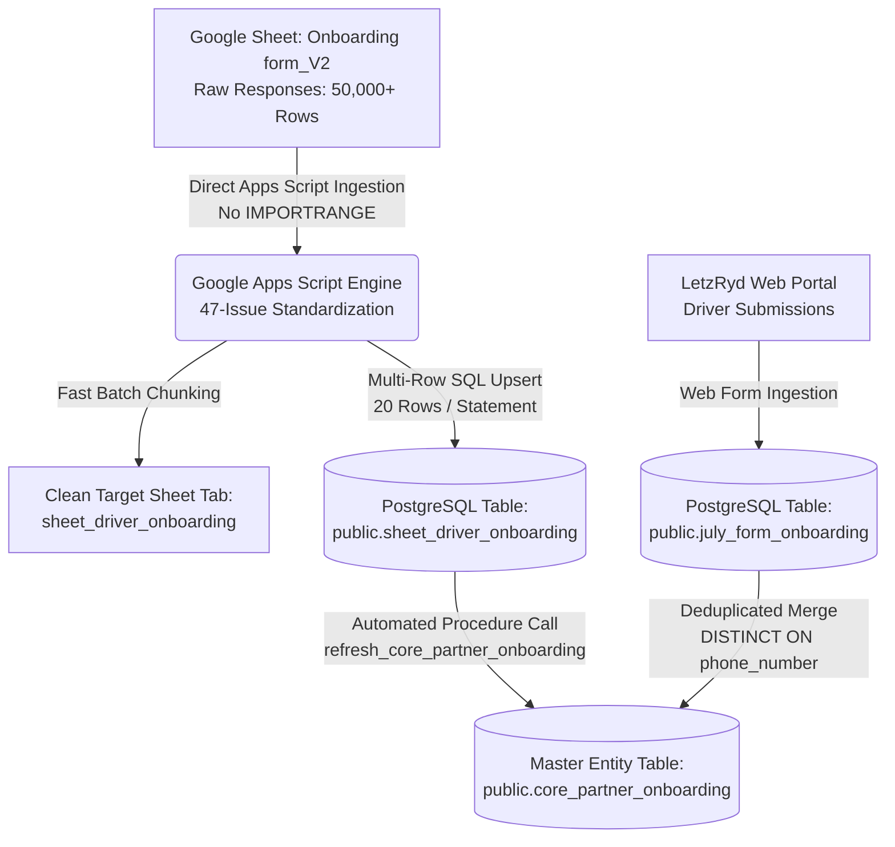

# LetzRyd Partner Onboarding Live Pipeline - Knowledge Transfer Documentation

Target Database: `35.200.196.113:5432`  
Database Name: `postgres`  
Target Landing Table: `public.sheet_driver_onboarding`  
Target Master Table: `public.core_partner_onboarding`  
Source Google Sheet Tab: `Onboarding form_V2` (from raw Google Forms)  
Clean Intermediate Sheet Tab: `sheet_driver_onboarding`  
Portal Form Source Table: `public.july_form_onboarding`  
Technology Stack: Google Apps Script (JavaScript), PostgreSQL 14+, JDBC, PL/pgSQL  

---

## 1. Executive Summary & Overview

The **LetzRyd Partner Onboarding Live Pipeline** provides real-time data ingestion, multi-field standardization, and unified master consolidation for all incoming driver-partner onboarding records across LetzRyd.

Operational hubs onboard driver-partners via physical Google Form entries (`Onboarding form_V2`) and the web portal (`july_form_onboarding`). This pipeline standardizes raw form entries (resolving all 47 data quality issues ISS-16 through ISS-62), ingests them into the `public.sheet_driver_onboarding` PostgreSQL landing table, and unifies them into the master entity table **`public.core_partner_onboarding`**.

### Primary System Guarantees
- **Zero IMPORTRANGE Dependency**: Cross-sheet data extraction reads directly in memory using Google Apps Script's `openByUrl()`, completely bypassing Google Sheets formula record limits and cell freeze.
- **Real-Time Synchronization**: Live On-Edit (`handleOnEdit`) and Form-Submit (`handleOnFormSubmit`) trigger ingestion with ~1–2 seconds latency.
- **1-Minute Catch-Up Trigger**: `syncRecentOnboardings` processes rolling windows of recent records in under 1 second.
- **Zero Sequence Number Burning**: PostgreSQL upserts use strict conflict resolution ensuring gapless sequential IDs.
- **Unified Master Entity**: The stored procedure `refresh_core_partner_onboarding()` automatically merges Google Sheet and Portal submissions on unique phone numbers.

---

## 2. High-Level Architecture & Data Flow



---

## 3. Directory Contents

| File | Description |
|---|---|
| [`partner_onboarding_pipeline_appscript.js`](./partner_onboarding_pipeline_appscript.js) | Production Google Apps Script code (~984 lines) featuring direct cross-sheet extraction, 47-issue standardization engine, sub-chunked multi-row SQL upserts, and automated trigger handlers. |
| [`schema.sql`](./schema.sql) | PostgreSQL DDL definitions for `sheet_driver_onboarding`, `core_partner_onboarding`, performance B-Tree indexes, and the automated `refresh_core_partner_onboarding()` consolidation procedure. |
| [`data_issues.md`](./data_issues.md) | Comprehensive audit of all 47 data quality anomalies (`ISS-16` through `ISS-62`) from `Master_Issue_Standardization_Catalog.xlsx` and their exact programmatic transformations. |
| [`README.md`](./README.md) | Complete Knowledge Transfer (KT) document, system architecture, and operational runbook. |

---

## 4. PostgreSQL Database Schema DDL

### 4.1 Landing Table: `public.sheet_driver_onboarding`
```sql
CREATE TABLE IF NOT EXISTS public.sheet_driver_onboarding (
    id BIGSERIAL PRIMARY KEY,
    submission_timestamp TIMESTAMP WITH TIME ZONE NOT NULL,
    submitter_email VARCHAR(255),
    city VARCHAR(100),
    onboarding_type VARCHAR(50) DEFAULT 'Individual',
    lead_source VARCHAR(100),
    driver_plan VARCHAR(100),
    driver_name VARCHAR(255) NOT NULL,
    driver_phone VARCHAR(20) NOT NULL,
    whatsapp_phone VARCHAR(20),
    emergency_name VARCHAR(255),
    emergency_phone VARCHAR(20),
    reference_name VARCHAR(255),
    reference_phone VARCHAR(20),
    father_name VARCHAR(255),
    dob DATE,
    aadhaar_address TEXT,
    present_address TEXT,
    pan_number VARCHAR(50),
    aadhaar_number VARCHAR(50),
    dl_expiry DATE,
    dl_number VARCHAR(100),
    upi_id VARCHAR(100),
    pan_aadhaar_linked VARCHAR(50),
    dl_front TEXT,
    dl_back TEXT,
    aadhaar_front TEXT,
    aadhaar_back TEXT,
    pan_card TEXT,
    local_address_proof TEXT,
    selfie_photo TEXT,
    pan_aadhaar_photo TEXT,
    bank_details_doc TEXT,
    referral_phone VARCHAR(20),
    referral_name VARCHAR(255),
    account_name VARCHAR(255),
    account_number VARCHAR(100),
    ifsc_code VARCHAR(50),
    deposit_amount NUMERIC(12, 2) DEFAULT 0.00,
    partner_id VARCHAR(50),
    sheet_row_number INTEGER,
    created_at TIMESTAMP WITH TIME ZONE DEFAULT CURRENT_TIMESTAMP,
    updated_at TIMESTAMP WITH TIME ZONE DEFAULT CURRENT_TIMESTAMP,
    CONSTRAINT uq_sheet_driver_onboarding UNIQUE (submission_timestamp, driver_phone)
);
```

### 4.2 Master Unified Table: `public.core_partner_onboarding`
```sql
CREATE TABLE IF NOT EXISTS public.core_partner_onboarding (
    id BIGSERIAL PRIMARY KEY,
    partner_id VARCHAR(50) UNIQUE,
    driver_name VARCHAR(255) NOT NULL,
    phone_number VARCHAR(20) NOT NULL UNIQUE,
    whatsapp_number VARCHAR(20),
    dob DATE,
    city VARCHAR(100),
    onboarding_type VARCHAR(50) DEFAULT 'Individual',
    lead_source VARCHAR(100),
    driver_plan VARCHAR(100),
    father_name VARCHAR(255),
    present_address TEXT,
    permanent_address TEXT,
    emergency_name VARCHAR(255),
    emergency_phone VARCHAR(20),
    emergency_relationship VARCHAR(50),
    reference_name VARCHAR(255),
    reference_phone VARCHAR(20),
    dl_number VARCHAR(100),
    dl_expiry_date DATE,
    pan_number VARCHAR(50),
    aadhaar_number VARCHAR(50),
    pan_aadhaar_linked VARCHAR(50),
    bank_name VARCHAR(255),
    account_name VARCHAR(255),
    account_number VARCHAR(100),
    ifsc_code VARCHAR(50),
    upi_id VARCHAR(100),
    security_deposit NUMERIC(12, 2) DEFAULT 0.00,
    selfie_photo TEXT,
    dl_front TEXT,
    dl_back TEXT,
    aadhaar_card_front TEXT,
    aadhaar_card_back TEXT,
    pan_card_photo TEXT,
    local_address_proof TEXT,
    cancelled_cheque_photo TEXT,
    approval_status VARCHAR(50) DEFAULT 'Draft',
    is_documents_verified BOOLEAN DEFAULT FALSE,
    is_spring_verified BOOLEAN DEFAULT FALSE,
    source_origin VARCHAR(50) NOT NULL, -- 'GOOGLE_SHEET', 'PORTAL_FORM', or 'MERGED'
    source_sheet_row_id BIGINT,
    source_portal_form_id INTEGER,
    onboarding_timestamp TIMESTAMP WITH TIME ZONE,
    created_at TIMESTAMP WITH TIME ZONE DEFAULT CURRENT_TIMESTAMP,
    updated_at TIMESTAMP WITH TIME ZONE DEFAULT CURRENT_TIMESTAMP
);
```

---

## 5. Summary of 47-Issue Standardization Rules

| Category | Issue Range | Key Standardizations Implemented |
|---|---|---|
| **Partner ID Engine** | `ISS-16` to `ISS-21` | Deterministically generates `LETZ` + `<CITY>` + `<PHONE>` (e.g. `LETZBLR9380465352`); overwrites copy-paste typos and dropped formulas; strips `=COUNTIF` helper columns. |
| **Demographics & Contacts** | `ISS-22` to `ISS-35` | Standardizes casing to `'Operator'`/`'Individual'`; cleans accents and formats names uppercase; auto-falls back WhatsApp number to driver phone; resolves missing local present address to Aadhaar address. |
| **Government IDs & Compliance** | `ISS-36` to `ISS-48` | Validates 10-char uppercase PAN (`^[A-Z]{5}[0-9]{4}[A-Z]$`); extracts 12 clean Aadhaar digits; normalizes alphanumeric driving licenses; auto-transliterates Greek homoglyphs (e.g. `\u039A` $\to$ `K`). |
| **Banking & Payments** | `ISS-49` to `ISS-58` | Converts scientific notation floats in bank accounts to full integer strings; auto-inserts missing 5th zero in 10-char IFSC codes; extracts clean UPI handles; computes arithmetic deposits (`11000 + 3500` $\to$ `14500.00`); splits composite referral strings into phone & name. |
| **Documents & Clean Staging** | `ISS-59` to `ISS-62` | Converts `'-'` placeholders to SQL `NULL`; drops formula pre-fill columns and ghost unmapped columns (`Unnamed: 43-46`, `Mapping`, `Logic`, `Code`). |

---

## 6. Deployment & Operations Runbook

### Step 1: Database Setup
Execute [`schema.sql`](./schema.sql) in PostgreSQL:
```bash
psql -h 35.200.196.113 -U postgres -d postgres -f schema.sql
```

### Step 2: Google Apps Script Setup
1. In your target Google Spreadsheet, open **Extensions** $\to$ **Apps Script**.
2. Paste the entire code from [`partner_onboarding_pipeline_appscript.js`](./partner_onboarding_pipeline_appscript.js) into `Code.gs`.
3. Press `Ctrl + S` to save.

### Step 3: Run Full Historical Sync
1. Select function **`syncFromSourceSheetToTargetSheet`** from the toolbar dropdown.
2. Click **Run** (▶️).
3. The script will:
   - Read all 50,000+ raw entries from `Onboarding form_V2`.
   - Standardize and output 2,259 clean rows to `sheet_driver_onboarding`.
   - Upsert all records into PostgreSQL `public.sheet_driver_onboarding`.
   - Automatically execute `refresh_core_partner_onboarding()` to merge portal and sheet records.

### Step 4: Activate Continuous Triggers
1. Select function **`setupTriggers`** and click **Run**.
2. Automated triggers activated:
   - **`handleOnEdit`**: Captures spreadsheet edits in real time.
   - **`syncRecentOnboardings`**: 1-minute catch-up timer scanning recent rows in < 1 second.

---

## 7. Operational SQL Queries

### Query 1: Partner Distribution by Source
```sql
SELECT 
    source_origin,
    count(*) AS total_partners,
    count(DISTINCT phone_number) AS unique_phone_numbers,
    count(CASE WHEN approval_status = 'Approved' THEN 1 END) AS approved_count
FROM public.core_partner_onboarding
GROUP BY source_origin;
```

### Query 2: Search Driver Partner
```sql
SELECT * 
FROM public.core_partner_onboarding 
WHERE phone_number = '9380465352';
```

### Query 3: Manual Refresh of Core Consolidation
```sql
CALL refresh_core_partner_onboarding();
```
