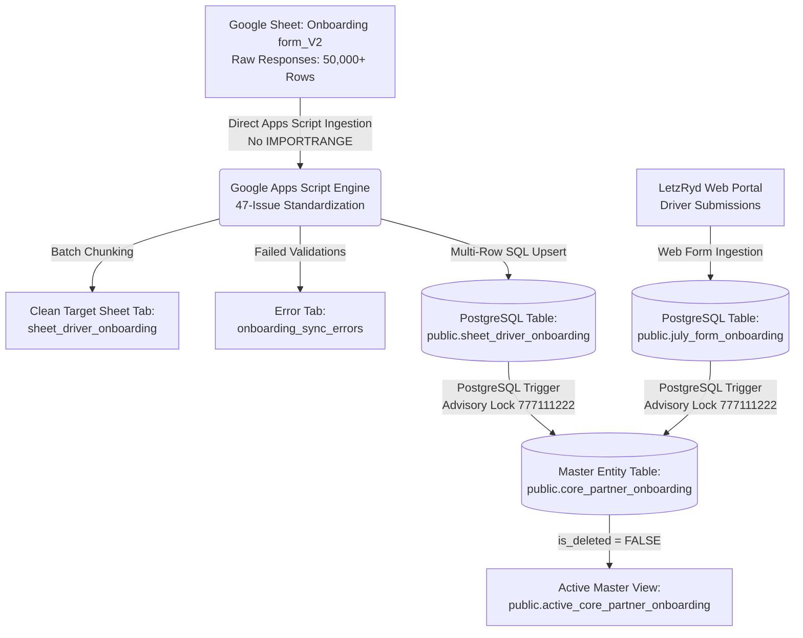

# LetzRyd Partner Onboarding Live Pipeline - Knowledge Transfer Documentation

Target Database: `YOUR_DB_HOST_HERE:5432`  
Database Name: `postgres`  
Target Landing Table: `public.sheet_driver_onboarding`  
Target Master Table: `public.core_partner_onboarding`  
Active Filtered View: `public.active_core_partner_onboarding`  
Source Google Sheet Tab: `Onboarding form_V2` (from raw Google Forms)  
Clean Intermediate Sheet Tab: `sheet_driver_onboarding`  
Error Logging Tab: `onboarding_sync_errors`  
Portal Form Source Table: `public.july_form_onboarding`  
Technology Stack: Google Apps Script (JavaScript), PostgreSQL 14+, JDBC, PL/pgSQL  

---

## 1. Executive Summary & Overview

The **LetzRyd Partner Onboarding Live Pipeline** provides real-time data ingestion, multi-field standardization, and unified master consolidation for all incoming driver-partner onboarding records across LetzRyd.

Operational hubs onboard driver-partners via physical Google Form entries (`Onboarding form_V2`) and the web portal (`july_form_onboarding`). This pipeline standardizes raw form entries (resolving all 47 data quality issues ISS-16 through ISS-62), ingests them into the `public.sheet_driver_onboarding` PostgreSQL landing table, and unifies them into the master entity table **`public.core_partner_onboarding`**.

### Primary System Guarantees
- **Zero IMPORTRANGE Dependency**: Cross-sheet data extraction reads directly in memory using Google Apps Script's `openByUrl()`, completely bypassing Google Sheets formula record limits and cell freeze.
- **Native Real-Time Database Synchronization**: Live row-level PostgreSQL triggers (`trg_sheet_driver_onboarding_sync` and `trg_july_form_onboarding_sync`) ensure sub-10ms synchronization into core master tables.
- **Strict Gapless Sequencing**: Utilizes transactional advisory locking (`pg_advisory_xact_lock(777111222)`) and `id BIGINT PRIMARY KEY` to prevent sequence jumping and burning.
- **IST Timestamp Contract**: Stored as clean `TIMESTAMP WITHOUT TIME ZONE` in Indian Standard Time (`CURRENT_TIMESTAMP AT TIME ZONE 'Asia/Kolkata'`), eliminating UTC offset discrepancies.
- **Deterministic Canonical Partner IDs**: Validated company-wide pattern `^LETZ(BLR|HYD|MUM|PUN)(IP)?[0-9]{10}$` resolving city abbreviations deterministically.
- **100% Bank Proof Retention**: Maps `bank_details_doc` to `cancelled_cheque_photo` across all ingestion and consolidation queries.
- **Soft Delete Tracking**: Deletions in source systems flag `is_deleted = TRUE` and `deleted_at = NOW()` without hard deletion.
- **Error Routing**: Records with invalid/missing phone numbers are routed to `onboarding_sync_errors` without halting batch ingestion.

---

## 2. High-Level Architecture & Data Flow



---

## 3. Directory Contents

| File | Description |
|---|---|
| [`partner_onboarding_pipeline_appscript.js`](./partner_onboarding_pipeline_appscript.js) | Production Google Apps Script code featuring direct cross-sheet extraction, 47-issue standardization engine, error routing to `onboarding_sync_errors`, sanitized credentials via Script Properties, and event-driven trigger handlers. |
| [`schema.sql`](./schema.sql) | PostgreSQL DDL definitions for `sheet_driver_onboarding`, `core_partner_onboarding`, `active_core_partner_onboarding`, advisory locks, bank proof backfill, and migration scripts. |
| [`data_issues.md`](./data_issues.md) | Comprehensive audit of all 47 data quality anomalies (`ISS-16` through `ISS-62`) from `Master_Issue_Standardization_Catalog.xlsx` and their exact programmatic transformations. |
| [`README.md`](./README.md) | Complete Knowledge Transfer (KT) document, system architecture, and operational runbook. |

---

## 4. PostgreSQL Database Schema DDL

### 4.1 Landing Table: `public.sheet_driver_onboarding`
```sql
CREATE TABLE IF NOT EXISTS public.sheet_driver_onboarding (
    id BIGSERIAL PRIMARY KEY,
    submission_timestamp TIMESTAMP WITHOUT TIME ZONE NOT NULL,
    submitter_email VARCHAR(255),
    city VARCHAR(100),
    onboarding_type VARCHAR(50) DEFAULT 'Individual',
    lead_source VARCHAR(100),
    driver_plan VARCHAR(100),
    driver_name VARCHAR(255) NOT NULL,
    driver_phone VARCHAR(20) NOT NULL,
    whatsapp_phone VARCHAR(20),
    emergency_name VARCHAR(255),
    emergency_phone VARCHAR(20),
    reference_name VARCHAR(255),
    reference_phone VARCHAR(20),
    father_name VARCHAR(255),
    dob DATE,
    aadhaar_address TEXT,
    present_address TEXT,
    pan_number VARCHAR(50),
    aadhaar_number VARCHAR(50),
    dl_expiry DATE,
    dl_number VARCHAR(100),
    upi_id VARCHAR(100),
    pan_aadhaar_linked VARCHAR(50),
    dl_front TEXT,
    dl_back TEXT,
    aadhaar_front TEXT,
    aadhaar_back TEXT,
    pan_card TEXT,
    local_address_proof TEXT,
    selfie_photo TEXT,
    pan_aadhaar_photo TEXT,
    bank_details_doc TEXT,
    referral_phone VARCHAR(20),
    referral_name VARCHAR(255),
    account_name VARCHAR(255),
    account_number VARCHAR(100),
    ifsc_code VARCHAR(50),
    deposit_amount NUMERIC(12, 2) DEFAULT 0.00,
    partner_id VARCHAR(50),
    sheet_row_number INTEGER,
    created_at TIMESTAMP WITHOUT TIME ZONE DEFAULT (CURRENT_TIMESTAMP AT TIME ZONE 'Asia/Kolkata'),
    updated_at TIMESTAMP WITHOUT TIME ZONE DEFAULT (CURRENT_TIMESTAMP AT TIME ZONE 'Asia/Kolkata'),
    CONSTRAINT uq_sheet_driver_onboarding UNIQUE (submission_timestamp, driver_phone)
);
```

### 4.2 Master Unified Table: `public.core_partner_onboarding`
```sql
CREATE TABLE IF NOT EXISTS public.core_partner_onboarding (
    id BIGINT PRIMARY KEY,
    partner_id VARCHAR(50) UNIQUE,
    driver_name VARCHAR(255) NOT NULL,
    phone_number VARCHAR(20) NOT NULL UNIQUE,
    whatsapp_number VARCHAR(20),
    dob DATE,
    city VARCHAR(100),
    onboarding_type VARCHAR(50) DEFAULT 'Individual',
    lead_source VARCHAR(100),
    driver_plan VARCHAR(100),
    father_name VARCHAR(255),
    present_address TEXT,
    permanent_address TEXT,
    emergency_name VARCHAR(255),
    emergency_phone VARCHAR(20),
    emergency_relationship VARCHAR(50),
    reference_name VARCHAR(255),
    reference_phone VARCHAR(20),
    dl_number VARCHAR(100),
    dl_expiry_date DATE,
    pan_number VARCHAR(50),
    aadhaar_number VARCHAR(50),
    pan_aadhaar_linked VARCHAR(50),
    bank_name VARCHAR(255),
    account_name VARCHAR(255),
    account_number VARCHAR(100),
    ifsc_code VARCHAR(50),
    upi_id VARCHAR(100),
    security_deposit NUMERIC(12, 2) DEFAULT 0.00,
    selfie_photo TEXT,
    dl_front TEXT,
    dl_back TEXT,
    aadhaar_card_front TEXT,
    aadhaar_card_back TEXT,
    pan_card_photo TEXT,
    local_address_proof TEXT,
    cancelled_cheque_photo TEXT,
    approval_status VARCHAR(50) DEFAULT 'Draft',
    is_documents_verified BOOLEAN DEFAULT FALSE,
    is_spring_verified BOOLEAN DEFAULT FALSE,
    source_origin VARCHAR(50) NOT NULL, -- 'GOOGLE_SHEET', 'PORTAL_FORM', or 'MERGED'
    source_sheet_row_id BIGINT,
    source_portal_form_id INTEGER,
    is_deleted BOOLEAN DEFAULT FALSE,
    deleted_at TIMESTAMP WITHOUT TIME ZONE,
    onboarding_timestamp TIMESTAMP WITHOUT TIME ZONE,
    created_at TIMESTAMP WITHOUT TIME ZONE DEFAULT (CURRENT_TIMESTAMP AT TIME ZONE 'Asia/Kolkata'),
    updated_at TIMESTAMP WITHOUT TIME ZONE DEFAULT (CURRENT_TIMESTAMP AT TIME ZONE 'Asia/Kolkata')
);

CREATE OR REPLACE VIEW public.active_core_partner_onboarding AS
SELECT * FROM public.core_partner_onboarding
WHERE is_deleted = FALSE;
```

---

## 5. Deployment & Operations Runbook

### Step 1: Database Setup & Migration
Execute [`schema.sql`](./schema.sql) in PostgreSQL:
```bash
psql -h YOUR_DB_HOST_HERE -U postgres -d postgres -f schema.sql
```

### Step 2: Google Apps Script Credential Configuration
1. In your target Google Spreadsheet, open **Extensions** $\to$ **Apps Script**.
2. Navigate to **Project Settings** (⚙️) $\to$ **Script Properties**.
3. Add the following properties securely:
   - `DB_HOST`: Your PostgreSQL host IP/domain
   - `DB_PORT`: `5432`
   - `DB_NAME`: `postgres`
   - `DB_USER`: `postgres`
   - `DB_PASSWORD`: Your database password
4. Paste [`partner_onboarding_pipeline_appscript.js`](./partner_onboarding_pipeline_appscript.js) into `Code.gs`.
5. Run `setupTriggers` to register event-driven triggers and hourly reconciliation.

---

## 6. Verification Queries

```sql
-- Check total active partner counts and source distribution
SELECT 
    source_origin,
    count(*) AS total_partners,
    count(DISTINCT phone_number) AS unique_phone_numbers,
    count(CASE WHEN cancelled_cheque_photo IS NOT NULL THEN 1 END) AS with_bank_proof,
    count(CASE WHEN approval_status = 'Approved' THEN 1 END) AS approved_count
FROM public.core_partner_onboarding
GROUP BY source_origin;

-- Verify zero corrupted partner IDs
SELECT partner_id, driver_name, phone_number, city
FROM public.core_partner_onboarding
WHERE partner_id !~ '^LETZ(BLR|HYD|MUM|PUN)(IP)?[0-9]{10}$';

-- Verify continuous gapless sequence IDs
SELECT count(*) AS actual_rows, max(id) AS max_id, COALESCE(max(id), 0) - count(*) AS gap
FROM public.core_partner_onboarding;
```
