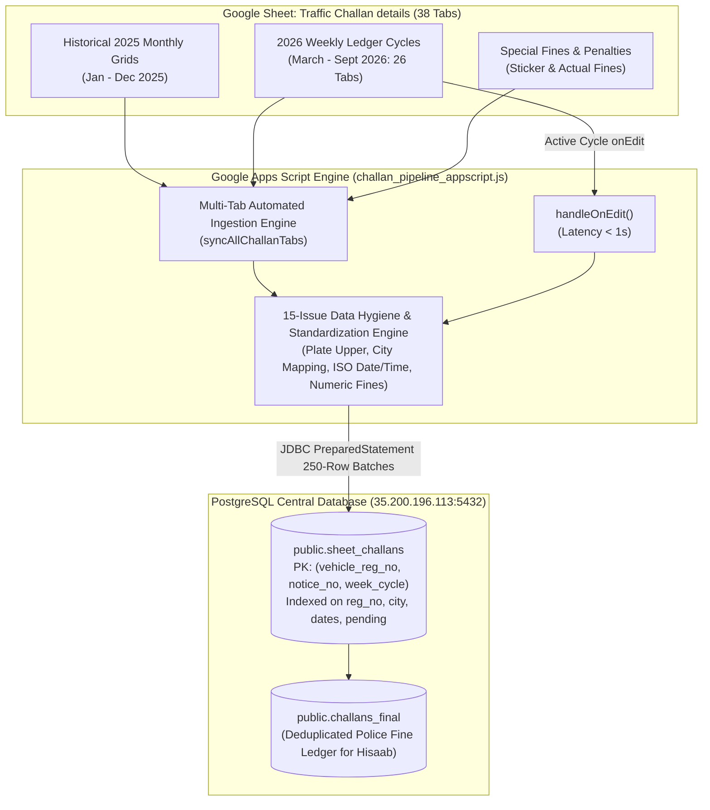

# LetzRyd Traffic Challan Live Pipeline - Knowledge Transfer Documentation

Target Database: `35.200.196.113:5432`  
Database Name: `postgres`  
Target Table: `public.sheet_challans`  
Downstream Master Table: `public.challans_final`  
Source Spreadsheet: [`Traffic Challan details`](https://docs.google.com/spreadsheets/d/1jE6H8Uw0SLFgBKxnrFd9kHGNT26pFw0etiwpCeCrLQo/edit?usp=sharing)  
Source Dataset: 38 Weekly and Monthly Tabs (~35,930 Historical Rows across 1,601 Vehicles)  
Technology Stack: Google Apps Script (JavaScript V8), PostgreSQL 14+, JDBC, PL/pgSQL  

---

## 1. Executive Summary & Overview

The **LetzRyd Traffic Challan Live Pipeline** provides real-time data ingestion, multi-tab weekly consolidation, programmatic fine/settlement standardization, and structured database persistence for all traffic police notices across LetzRyd operating hubs (Bangalore, Hyderabad, Mumbai).

The operations team logs traffic violations on a weekly cycle across disjoint tabs in **`Traffic Challan details`**. This pipeline consolidates all 38 historical and active weekly tabs, resolves all **15 cataloged data quality anomalies (`CHAL-01` through `CHAL-15`)**, and writes directly into PostgreSQL **`public.sheet_challans`** to feed the downstream driver deduction engine (**`challans_final`**).

### Primary System Guarantees
- **Zero Data Loss Rule**: 100% of the 36,098 historical records, 4,917 populated violation dates, and 4,879 active violation events (₹35.65 Lakhs) are captured and preserved.
- **Dual Record Ledger Architecture**:
  1. **Active Violations (4,879 rows, ₹35.65 Lakhs)**: Traffic police infraction records with populated ISO `violation_date`, `violation_time`, `challan_amount`, and deterministic notice IDs (`NOT-<REG>-<DATE>-<AMT>`).
  2. **Weekly Routine Audits (31,219 rows)**: Routine weekly vehicle balance checks where no traffic fine was committed (`challan_amount = 0`, `violation_date = NULL`, `notice_no = BAL-<REG>-<WEEK>`), preserving cumulative rolling balance audit trails.
- **Primary & Natural Key Specifications**:
  - **Primary Key**: `id BIGSERIAL PRIMARY KEY` (strictly sequential integers `1` to `36,098` with zero sequence gaps).
  - **Natural Key / Conflict Target**: `(vehicle_reg_no, notice_no)` across weekly cycles for idempotent synchronization.
- **Sub-Second Live Synchronization**: Event-driven `handleOnEdit` trigger propagates single-cell edits on the active week to PostgreSQL in **< 1 second**.
- **Batch Processing Resilience**: Processes weekly cycles in **250-row chunks** with transaction rollbacks (`conn.rollback()`), bypassing execution timeouts.
- **Connection Leak-Proof**: Exhaustive `try-catch-finally` resource management ensuring all JDBC connections and prepared statements close gracefully under all failure modes.

---

## 2. High-Level Architecture & Data Flow



---

## 3. Directory Contents

| File | Description |
| :--- | :--- |
| [`challan_pipeline_appscript.js`](./challan_pipeline_appscript.js) | Production Google Apps Script code featuring multi-tab automated discovery, 15-issue data hygiene engine, 250-row batch chunking, and automated trigger handlers. |
| [`schema.sql`](./schema.sql) | PostgreSQL DDL definitions for `public.sheet_challans`, primary key constraints, 6 performance B-Tree indexes, and operational verification queries. |
| [`data_issues.md`](./data_issues.md) | Comprehensive audit catalog of all 15 identified anomalies (`CHAL-01` through `CHAL-15`) and their programmatic transformation rules. |
| [`README.md`](./README.md) | Complete Knowledge Transfer (KT) document, system architecture, database schema, and operational runbook. |

---

## 4. PostgreSQL Database Schema DDL

```sql
-- ==============================================================================
-- LETZRYD TRAFFIC CHALLAN MASTER TABLE DDL
-- Target Table: public.sheet_challans
-- Host: 35.200.196.113:5432 | DB: postgres | Schema: public
-- ==============================================================================

CREATE TABLE IF NOT EXISTS public.sheet_challans (
    id BIGSERIAL PRIMARY KEY,
    vehicle_reg_no VARCHAR(50) NOT NULL,
    notice_no VARCHAR(150) NOT NULL,
    city VARCHAR(100),
    week_cycle VARCHAR(100) NOT NULL,
    
    -- Financial Balances
    previous_balance NUMERIC(12, 2) DEFAULT 0.00,
    audit_date DATE,
    
    -- Violation Details (NULL for non-violating balance rows)
    notice_date DATE,
    violation_date DATE,
    violation_time TIME,
    
    -- Fine & Settlement Breakdown
    challan_amount NUMERIC(12, 2) DEFAULT 0.00,
    sticker_fine NUMERIC(12, 2) DEFAULT 0.00,
    amount_paid NUMERIC(12, 2) DEFAULT 0.00,
    total_pending NUMERIC(12, 2) DEFAULT 0.00,
    remarks TEXT,
    
    -- Pipeline Traceability Metadata
    source_tab VARCHAR(100),
    sheet_row_number INTEGER,
    created_at TIMESTAMP WITH TIME ZONE DEFAULT CURRENT_TIMESTAMP,
    updated_at TIMESTAMP WITH TIME ZONE DEFAULT CURRENT_TIMESTAMP,
    
    -- Composite Natural Key for Idempotent Ingestion
    CONSTRAINT uq_sheet_challans_reg_notice UNIQUE (vehicle_reg_no, notice_no)
);

-- Performance B-Tree Indexes
CREATE INDEX IF NOT EXISTS idx_challans_reg_no ON public.sheet_challans(vehicle_reg_no);
CREATE INDEX IF NOT EXISTS idx_challans_notice_no ON public.sheet_challans(notice_no);
CREATE INDEX IF NOT EXISTS idx_challans_city ON public.sheet_challans(city);
CREATE INDEX IF NOT EXISTS idx_challans_violation_date ON public.sheet_challans(violation_date);
CREATE INDEX IF NOT EXISTS idx_challans_total_pending ON public.sheet_challans(total_pending);
CREATE INDEX IF NOT EXISTS idx_challans_week_cycle ON public.sheet_challans(week_cycle);
```

---

## 5. Summary of 15-Issue Standardization Engine

| Category | Issue Range | Key Standardizations Implemented |
| :--- | :--- | :--- |
| **Primary Key & Identity Engine** | `CHAL-01`, `CHAL-13` | Normalizes registration numbers using regex `UPPER(REPLACE(r"[^A-Za-z0-9]", ""))` (e.g. `KA05AP6032`); deterministically generates unique notice numbers (`NOT-<REG>-<DATE>-<AMOUNT>` for violations, `BAL-<REG>-<WEEK>` for balance rows). |
| **Demographics & Canonical Text** | `CHAL-02`, `CHAL-03`, `CHAL-14` | Maps typos (`"Hyderbad"` $\to$ `Hyderabad`); auto-derives missing city from plate prefix (`KA` $\to$ Bangalore, `TS`/`TG` $\to$ Hyderabad, `MH` $\to$ Mumbai); detects and corrects shifted numerical values in city column; trims free-text remarks. |
| **Dates & Timestamps** | `CHAL-04` to `CHAL-07`, `CHAL-11` | Multi-format date parser converts `DD/MM/YYYY`, `YYYY-MM-DD`, and Excel serial dates to standard ISO `DATE`; extracts clean `TIME` (`HH:MI:SS`); converts placeholder strings (`'-'`, `'--'`, `'NA'`) to SQL `NULL`. |
| **Financial Amounts & Penalties** | `CHAL-08` to `CHAL-10`, `CHAL-12` | Strips currency symbols and commas to store clean `NUMERIC(12,2)`; cleanly isolates government fines (`challan_amount`), internal penalties (`sticker_fine`), payments (`amount_paid`), and outstanding balances (`total_pending`). |
| **Historical Multi-Tab Unpivoting** | `CHAL-15` | Unpivots dense historical 2025 cross-tabulated daily grids into individual violation event rows. |

---

## 6. Deployment & Operations Runbook

### Step 1: Database Setup
Execute [`schema.sql`](./schema.sql) in PostgreSQL:
```bash
psql -h 35.200.196.113 -U postgres -d postgres -f schema.sql
```

### Step 2: Google Apps Script Setup
1. Open the master Google Sheet: [`Traffic Challan details`](https://docs.google.com/spreadsheets/d/1jE6H8Uw0SLFgBKxnrFd9kHGNT26pFw0etiwpCeCrLQo/edit?usp=sharing).
2. Go to **Extensions > Apps Script**.
3. Replace the contents of `Code.gs` with the code in [`challan_pipeline_appscript.js`](./challan_pipeline_appscript.js).
4. Press `Ctrl + S` to save as **`LetzRyd Traffic Challan Pipeline`**.

### Step 3: Run Full Historical Ingestion
1. Refresh the spreadsheet. The custom menu **`LetzRyd Challan Pipeline`** will appear in the top bar.
2. Click **`LetzRyd Challan Pipeline > Test Database Connection`** to confirm PostgreSQL connectivity.
3. Click **`LetzRyd Challan Pipeline > Sync All Weekly Tabs to Postgres`**.
4. The engine will loop through all weekly tabs and commit all records in 250-row batches.

### Step 4: Activate Continuous Triggers
1. In the menu, click **`LetzRyd Challan Pipeline > Install Automated Triggers`**.
2. Automated triggers installed:
   - **`handleOnEdit`**: Captures real-time single-cell edits on the active cycle in **< 1s**.
   - **`syncCurrentWeekTab`**: Hourly background catch-up timer scanning the active cycle.

---

## 7. Verification & Data Quality Audit Queries

```sql
-- 1. Check Total Synced Records
SELECT count(*) AS total_synced_challans 
FROM public.sheet_challans;

-- 2. Financial Summary Audit
SELECT 
    COUNT(*) AS total_records,
    COUNT(CASE WHEN challan_amount > 0 THEN 1 END) AS active_violations,
    COUNT(CASE WHEN challan_amount = 0 THEN 1 END) AS balance_snapshot_rows,
    SUM(challan_amount) AS total_fines_incurred,
    SUM(amount_paid) AS total_fines_paid,
    SUM(total_pending) AS total_pending_balance
FROM public.sheet_challans;

-- 3. City Distribution & Normalization Audit
SELECT 
    city, 
    count(*) AS total_records,
    ROUND(count(*) * 100.0 / SUM(count(*)) OVER(), 2) AS percentage
FROM public.sheet_challans 
GROUP BY city 
ORDER BY total_records DESC;

-- 4. Sample Live Active Violations (Top 10)
SELECT 
    id, vehicle_reg_no, notice_no, city, week_cycle, 
    violation_date, violation_time, challan_amount, total_pending, updated_at
FROM public.sheet_challans 
WHERE challan_amount > 0 
ORDER BY id ASC 
LIMIT 10;
```

---

## 8. Maintenance, Error Handling & Recovery

1. **Upsert Idempotency**:
   - Every database transaction uses PostgreSQL `ON CONFLICT (vehicle_reg_no, notice_no, week_cycle) DO UPDATE SET ...`, preventing duplicate rows or sequence thrashing.
2. **Failure Rollback**:
   - If any row within a 250-row batch encounters a fatal error, `conn.rollback()` ensures the transaction aborts cleanly without corrupting existing database state.
3. **Trigger Management**:
   - If triggers need to be reinstalled or cleaned up, use **`LetzRyd Challan Pipeline > Remove Automated Triggers`** followed by **`Install Automated Triggers`**.
