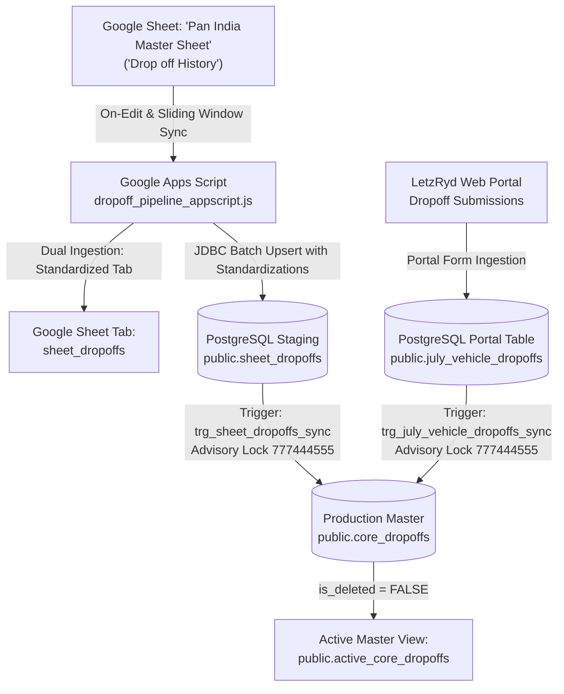

# LetzRyd Vehicle Dropoff Google Sheet Pipeline & PostgreSQL Master Ingestion

Real-time and batch synchronization engine bridging vehicle dropoff / return reports from Google Sheets (`Drop off History` in `Pan India Master Sheet.xlsx`) and web portal submissions (`public.july_vehicle_dropoffs`) into the centralized production PostgreSQL database (`public.core_dropoffs`).

---

## Architecture Overview



---

## Key Guarantees & V2 Audit Enhancements

1. **Cross-Source Deduplication & Merge State**:
   - Reconciles sheet and portal submissions on matching `(vehicle_number, return_date)`. When returns arrive from both sources for the same vehicle dropoff event, portal details merge onto sheet records and mark `data_source = 'MERGED'` without creating duplicate ledger liabilities.
2. **Gapless Continuous Sequencing**:
   - Primary key is `id BIGINT PRIMARY KEY`. Ingestion uses transactional advisory locking (`pg_advisory_xact_lock(777444555)`) and explicit `UPDATE` for existing records, completely eliminating sequence burning.
3. **Signed Debt Polarity Contract**:
   - Standardizes all driver liabilities, pending dues, and damage penalties as negative floats (e.g. `₹500` liability $\to$ `-500.00`) to accurately feed downstream Hisaab settlement deduction engines.
4. **Pure IST Timestamp Contract**:
   - Timestamps stored as `TIMESTAMP WITHOUT TIME ZONE` in Indian Standard Time (`(CURRENT_TIMESTAMP AT TIME ZONE 'Asia/Kolkata')`).
5. **Multi-Format Resilience**:
   - Ingests multi-format return dates (`DD/MM/YYYY`, `YYYY-MM-DD`, 5-digit Excel epoch serials), trims and validates uppercase vehicle plates (8–12 chars), and automatically detects operator types (`LETZ%IP%`).
6. **Credential Security**:
   - Hardcoded database passwords removed in favor of dynamic `PropertiesService.getScriptProperties()` with `setupScriptProperties()` helper.

---

## Target Database Schema

- **Host**: `YOUR_DB_HOST_HERE:5432`
- **Database**: `postgres`
- **Staging Table**: `public.sheet_dropoffs`
- **Portal Table**: `public.july_vehicle_dropoffs`
- **Master Single Source of Truth**: `public.core_dropoffs`
- **Active Master View**: `public.active_core_dropoffs`
- **Consolidation Function**: `public.refresh_core_dropoffs()`

---

## Directory Contents

| File | Description |
| :--- | :--- |
| [`dropoff_pipeline_appscript.js`](./dropoff_pipeline_appscript.js) | Production Google Apps Script engine featuring dual ingestion, live `handleOnEdit` event streaming, 11-issue data hygiene engine, custom spreadsheet UI menu, 250-row batch chunking, and automated trigger handlers. |
| [`schema.sql`](./schema.sql) | PostgreSQL DDL definitions for `public.sheet_dropoffs`, `public.core_dropoffs`, advisory lock `777444555`, dual row-level triggers, consolidation procedure `refresh_core_dropoffs()`, and operational verification queries. |
| [`data_issues.md`](./data_issues.md) | Comprehensive 13-column audit catalog documenting all 11 operational anomalies (`ISS-01` through `ISS-11`), category breakdown, and team lead audit resolution logs. |
| [`README.md`](./README.md) | Complete Knowledge Transfer (KT) document, system architecture, database schema, and operational runbook. |

---

## Summary of 11-Issue Standardization Engine

| Category | Issue Range | Key Standardizations Implemented |
| :--- | :--- | :--- |
| **Data Integrity & Headers** | `ISS-01`, `ISS-02`, `ISS-05` | Filters repeated header rows (`Return Date = 'Return Date'`); multi-format date parser converts `DD/MM/YYYY`, ISO, and Excel serial integers (`46272` $\to$ `2026-09-07`); validates uppercase alphanumeric vehicle plate (8–12 chars). |
| **Driver & Operator Profiles** | `ISS-03`, `ISS-04`, `ISS-07`, `ISS-08` | Coalesces missing/null driver IDs to `'UNKNOWN_DRIVER'`; standardizes driver names with `'Unknown Driver'` fallback; applies Title Case on driver types (`Operator`, `Individual`); infers missing types from `LETZ%IP%` operator prefix. |
| **Financial Balances & Liabilities** | `ISS-06` | Strips currency symbols (`₹`), commas, and hyphens; handles accounting format `(500.00)` $\to$ `-500.00`; standardizes all debts to negative numbers; maps `'Pending'`/`'TBD'` to `NULL`. |
| **Demographics & Operational Enums** | `ISS-09`, `ISS-10` | Normalizes 3-letter city abbreviations (`BLR` $\to$ `Bengaluru`, `HYD` $\to$ `Hyderabad`, `MUM` $\to$ `Mumbai`, `PUN` $\to$ `Pune`) with plate fallback (`KA` $\to$ `Bengaluru`, `TS/TG` $\to$ `Hyderabad`, `MH` $\to$ `Mumbai`); standardizes return reasons (`Attrition`, `Repair and Maintenance`, `Force Recovery`). |
| **Master Entity Consolidation** | `ISS-11` | Employs `source_row` unique constraint for sheet sync and gapless `id BIGINT PRIMARY KEY` with advisory locking (`777444555`) for core master consolidation. |

---

## Deployment & Operations Runbook

### Step 1: Database Setup
Execute [`schema.sql`](./schema.sql) in PostgreSQL:
```bash
psql -h YOUR_DB_HOST_HERE -U postgres -d postgres -f schema.sql
```

### Step 2: Google Apps Script Setup
1. Open the target Google Sheet: [`LetzRyd_Sheet_Dropoffs_Master`](https://docs.google.com/spreadsheets/d/1lb2BArHkQynUSA2hs_GAhCdjhOlwGIFIVjqA32Jw5M8/edit?usp=sharing).
2. Go to **Extensions > Apps Script**.
3. Paste the contents of [`dropoff_pipeline_appscript.js`](./dropoff_pipeline_appscript.js).
4. Press `Ctrl + S` to save.

### Step 3: Run Full Historical Ingestion
1. In the Apps Script function dropdown, select **`syncAllDropoffs`** (or use the sheet menu **LetzRyd Dropoffs > Sync All Records (Full)**) and click **▶ Run**.
2. All historical dropoff records will commit in 250-row batches into PostgreSQL `public.sheet_dropoffs` and populate the standardized `sheet_dropoffs` tab.

### Step 4: Activate Automated Triggers
1. In the Apps Script function dropdown, select **`setupTriggers`** (or use the sheet menu **LetzRyd Dropoffs > Setup Automated Triggers**) and click **▶ Run**.
2. Automated triggers installed:
   - Removes any existing triggers to avoid duplicates.
   - **`syncRecentDropoffs`**: 1-minute time-driven catch-up sync.
   - **`handleOnEdit`**: Instant sync on cell and pasted range edits (< 1s).
   - **`handleOnFormSubmit`**: Instant sync on form submission.

---

## Verification & Data Quality Audit Queries

```sql
-- 1. Check Source Distribution in Master Table
SELECT 
    data_source, 
    COUNT(*) AS total_records,
    COUNT(DISTINCT vehicle_number) AS unique_vehicles,
    SUM(negative_balance) AS total_negative_balance,
    SUM(total_liability) AS total_combined_liability
FROM public.core_dropoffs
GROUP BY data_source;

-- 2. Verify Zero Duplicates on (vehicle_number, return_date)
SELECT 
    vehicle_number, 
    return_date, 
    COUNT(*) AS duplicate_count
FROM public.core_dropoffs
WHERE is_deleted = FALSE
GROUP BY vehicle_number, return_date
HAVING COUNT(*) > 1;

-- 3. Verify Gapless Sequential IDs
SELECT 
    COUNT(*) AS total_rows,
    MAX(id) AS max_id,
    MAX(id) - COUNT(*) AS gap_count,
    CASE 
        WHEN COUNT(*) = MAX(id) AND MIN(id) = 1 
        THEN '✅ 100% PERFECT: Gapless Sequential Integer (1, 2, 3... N)'
        ELSE '❌ Sequence Gap Detected'
    END AS validation_result
FROM public.core_dropoffs;

-- 4. City Normalization & Fleet Distribution
SELECT 
    city, 
    COUNT(*) AS total_dropoffs, 
    COUNT(DISTINCT vehicle_number) AS unique_vehicles,
    ROUND(COUNT(*) * 100.0 / SUM(COUNT(*)) OVER (), 2) AS pct_share
FROM public.active_core_dropoffs
GROUP BY city
ORDER BY total_dropoffs DESC;

-- 5. Return Reason Distribution
SELECT 
    return_type, 
    COUNT(*) AS total_records,
    ROUND(COUNT(*) * 100.0 / SUM(COUNT(*)) OVER (), 2) AS pct_share
FROM public.active_core_dropoffs
GROUP BY return_type
ORDER BY total_records DESC;
```
