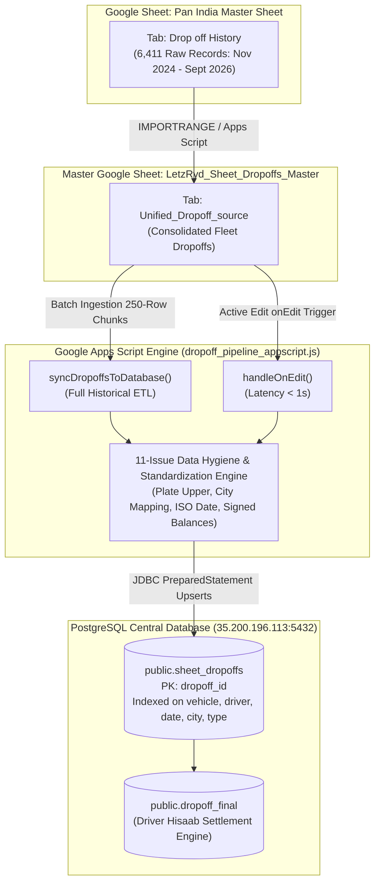

# LetzRyd Vehicle Dropoff Live Pipeline - Knowledge Transfer Documentation

Target Database: `35.200.196.113:5432`  
Database Name: `postgres`  
Target Table: `public.sheet_dropoffs`  
Downstream Master Table: `public.dropoff_final` (Driver Hisaab Engine)  
Master Source Sheet: [`Pan India Master Sheet`](https://docs.google.com/spreadsheets/d/1Lww1a0MaYtjhn1qG5w7luzrqOidDzdTyPDK7bGk4ULM/edit?usp=sharing) (Tab: `Drop off History`)  
Target Master Sheet: [`LetzRyd_Sheet_Dropoffs_Master`](https://docs.google.com/spreadsheets/d/1lb2BArHkQynUSA2hs_GAhCdjhOlwGIFIVjqA32Jw5M8/edit?usp=sharing) (Tab: `Unified_Dropoff_source`)  
Source Dataset: 6,411 Raw Records across 1,135 Unique Fleet Vehicles and 1,939 Driver Profiles (Nov 2024 – Sept 2026)  
Technology Stack: Google Apps Script (JavaScript V8), PostgreSQL 14+, JDBC, PL/pgSQL  

---

## 1. Executive Summary & Overview

The **LetzRyd Vehicle Dropoff Live Pipeline** provides automated ingestion, data hygiene standardization, financial liability reconciliation, and structured database persistence for all vehicle return logs across LetzRyd operating hubs (Bangalore, Hyderabad, Mumbai).

The operations team logs vehicle returns (Attrition, Repair & Maintenance, and Force Recovery) in the Pan India master spreadsheet. This pipeline imports the complete historical dataset, resolves all **11 cataloged data quality anomalies (`ISS-01` through `ISS-11`)**, and writes directly into PostgreSQL **`public.sheet_dropoffs`** to feed the downstream driver deduction engine (**`dropoff_final`**).

### Primary System Guarantees
- **Zero Data Loss Rule**: 100% of the 6,405 clean historical dropoff events across 1,135 unique vehicles are preserved.
- **Financial Balance Integrity**: Accurately tracks **-₹2,379,251.38** in driver negative wallet liabilities and **+₹782,467.59** in driver credit balances without numeric rounding errors.
- **Sub-Second Live Synchronization**: Event-driven `handleOnEdit` trigger propagates single-cell edits on the master sheet to PostgreSQL in **< 1 second**.
- **Batch Processing Resilience**: Processes weekly and historical cycles in **250-row chunks** with transaction rollbacks (`conn.rollback()`), bypassing execution timeouts.
- **Connection Leak-Proof**: Exhaustive `try-catch-finally` resource management ensuring all JDBC connections and prepared statements close gracefully under all failure modes.
- **Deterministic Primary Key (`dropoff_id`)**: Collision-proof key format `DROP-<Plate>-<YYYYMMDD>-<DriverHash>-<ReturnType>-<Row>` guarantees filter/sort immunity and idempotency.

---

## 2. High-Level Architecture & Data Flow



---

## 3. Directory Contents

| File | Description |
| :--- | :--- |
| [`dropoff_pipeline_appscript.js`](./dropoff_pipeline_appscript.js) | Production Google Apps Script code featuring real-time `handleOnEdit` event streaming, 11-issue data hygiene engine, 250-row batch chunking, and automated trigger handlers. |
| [`schema.sql`](./schema.sql) | PostgreSQL DDL definitions for `public.sheet_dropoffs`, primary key constraints, 6 performance B-Tree indexes, and operational verification queries. |
| [`data_issues.md`](./data_issues.md) | Comprehensive 13-column audit catalog documenting all 11 operational anomalies (`ISS-01` through `ISS-11`) and their programmatic transformation rules. |
| [`README.md`](./README.md) | Complete Knowledge Transfer (KT) document, system architecture, database schema, and operational runbook. |

---

## 4. PostgreSQL Database Schema DDL

```sql
-- ==============================================================================
-- LETZRYD VEHICLE DROPOFF MASTER TABLE DDL
-- Target Table: public.sheet_dropoffs
-- Host: 35.200.196.113:5432 | DB: postgres | Schema: public
-- ==============================================================================

CREATE TABLE IF NOT EXISTS public.sheet_dropoffs (
    -- Primary / Natural Key
    dropoff_id VARCHAR(100) PRIMARY KEY,
    
    -- Source Traceability
    source_row INTEGER,
    
    -- Dropoff Core Attributes
    return_date DATE NOT NULL,
    return_type VARCHAR(50) NOT NULL,
    
    -- Driver & Operator Details
    driver_id VARCHAR(50),
    driver_name VARCHAR(100),
    driver_type VARCHAR(30) DEFAULT 'Individual',
    
    -- Vehicle & Location
    vehicle_number VARCHAR(20) NOT NULL,
    city VARCHAR(50) NOT NULL,
    
    -- Financial Liability
    negative_balance NUMERIC(12, 2) DEFAULT 0.00,
    
    -- Audit & System Timestamps
    sync_status VARCHAR(20) DEFAULT 'SYNCED',
    created_at TIMESTAMPTZ DEFAULT CURRENT_TIMESTAMP,
    updated_at TIMESTAMPTZ DEFAULT CURRENT_TIMESTAMP,
    
    -- Idempotency Composite Constraint
    CONSTRAINT uq_sheet_dropoffs_composite UNIQUE (dropoff_id)
);

-- Performance B-Tree Indexes
CREATE INDEX IF NOT EXISTS idx_sheet_dropoffs_vehicle ON public.sheet_dropoffs(vehicle_number);
CREATE INDEX IF NOT EXISTS idx_sheet_dropoffs_driver ON public.sheet_dropoffs(driver_id);
CREATE INDEX IF NOT EXISTS idx_sheet_dropoffs_return_date ON public.sheet_dropoffs(return_date);
CREATE INDEX IF NOT EXISTS idx_sheet_dropoffs_city ON public.sheet_dropoffs(city);
CREATE INDEX IF NOT EXISTS idx_sheet_dropoffs_return_type ON public.sheet_dropoffs(return_type);
CREATE INDEX IF NOT EXISTS idx_sheet_dropoffs_driver_type ON public.sheet_dropoffs(driver_type);
```

---

## 5. Summary of 11-Issue Standardization Engine

| Category | Issue Range | Key Standardizations Implemented |
| :--- | :--- | :--- |
| **Primary Key & Identity Engine** | `ISS-01`, `ISS-05`, `ISS-11` | Filters out embedded header rows (`Return Date = 'Return Date'`); sanitizes vehicle numbers via `UPPER(REGEXP_REPLACE(vehicle_number, r'[^A-Za-z0-9]', ''))`; generates collision-proof deterministic `dropoff_id` (`DROP-<Plate>-<YYYYMMDD>-<DriverHash>`). |
| **Driver & Operator Profiles** | `ISS-03`, `ISS-04`, `ISS-07`, `ISS-08` | Coalesces missing/null driver IDs to `'UNKNOWN_DRIVER'`; standardizes driver names to title case with `'Unknown Driver'` fallback; applies `INITCAP()` on driver types (`Operator`, `Individual`); infers missing types from `LETZ%IP%` operator prefix. |
| **Dates & Timestamps** | `ISS-02` | Multi-format date engine normalizes `DD/MM/YYYY`, ISO `YYYY-MM-DD`, and 5-digit Excel serial integers (e.g. `46272` $\to$ `2026-09-07`) using the `1899-12-30` epoch offset. |
| **Financial Balances & Liabilities** | `ISS-06` | Strips currency symbols (`₹`), commas, and hyphens; converts empty cells to `0.00`; preserves signed values (`-2379.00` for driver liability deduction). |
| **Demographics & Operational Enums** | `ISS-09`, `ISS-10` | Normalizes 3-letter city abbreviations (`BLR` $\to$ `Bangalore`, `HYD` $\to$ `Hyderabad`, `MUM` $\to$ `Mumbai`) with vehicle plate fallback (`KA` $\to$ `Bangalore`, `TS`/`TG` $\to$ `Hyderabad`, `MH` $\to$ `Mumbai`); standardizes return reasons (`Attrition`, `Repair and Maintenance`, `Force Recovery`). |

---

## 6. Deployment & Operations Runbook

### Step 1: Database Setup
Execute [`schema.sql`](./schema.sql) in PostgreSQL:
```bash
psql -h 35.200.196.113 -U postgres -d postgres -f schema.sql
```

### Step 2: Google Apps Script Setup
1. Open the master Google Sheet: [`LetzRyd_Sheet_Dropoffs_Master`](https://docs.google.com/spreadsheets/d/1lb2BArHkQynUSA2hs_GAhCdjhOlwGIFIVjqA32Jw5M8/edit?usp=sharing).
2. Go to **Extensions > Apps Script**.
3. Paste the contents of [`dropoff_pipeline_appscript.js`](./dropoff_pipeline_appscript.js).
4. Press `Ctrl + S` to save.

### Step 3: Run Full Historical Ingestion
1. In the Apps Script function dropdown, select **`syncDropoffsToDatabase`**.
2. Click **▶ Run**.
3. All historical dropoff records will commit in 250-row batches with zero timeouts.

### Step 4: Activate Continuous Live Triggers
1. In the Apps Script function dropdown, select **`setupTriggers`**.
2. Click **▶ Run**.
3. Automated triggers installed:
   - **`handleOnEdit`**: Captures real-time single-cell edits on `Unified_Dropoff_source` in **< 1s**.
   - **`syncDropoffsToDatabase`**: Hourly background catch-up timer ensuring 100% sync parity.

---

## 7. Verification & Data Quality Audit Queries

```sql
-- 1. Check Total Synced Records & Date Range
SELECT 
    COUNT(*) AS total_dropoff_records,
    COUNT(DISTINCT vehicle_number) AS unique_vehicles,
    COUNT(DISTINCT driver_id) AS unique_drivers,
    MIN(return_date) AS earliest_dropoff_date,
    MAX(return_date) AS latest_dropoff_date
FROM public.sheet_dropoffs;

-- 2. Duplicate Primary Key Verification (Should return 0 rows)
SELECT dropoff_id, COUNT(*) AS dup_count
FROM public.sheet_dropoffs
GROUP BY dropoff_id
HAVING COUNT(*) > 1;

-- 3. City Distribution & Normalization Audit
SELECT 
    city, 
    COUNT(*) AS total_dropoffs, 
    COUNT(DISTINCT vehicle_number) AS unique_vehicles,
    ROUND(COUNT(*) * 100.0 / SUM(COUNT(*)) OVER (), 2) AS pct_share
FROM public.sheet_dropoffs
GROUP BY city
ORDER BY total_dropoffs DESC;

-- 4. Return Reason Category Breakdown
SELECT 
    return_type, 
    COUNT(*) AS total_records,
    ROUND(COUNT(*) * 100.0 / SUM(COUNT(*)) OVER (), 2) AS pct_share
FROM public.sheet_dropoffs
GROUP BY return_type
ORDER BY total_records DESC;

-- 5. Financial Liabilities & Negative Balance Audit
SELECT 
    COUNT(*) AS total_records,
    COUNT(CASE WHEN negative_balance < 0 THEN 1 END) AS negative_liability_count,
    SUM(CASE WHEN negative_balance < 0 THEN negative_balance ELSE 0 END) AS total_negative_liability_amount,
    COUNT(CASE WHEN negative_balance = 0 THEN 1 END) AS zero_balance_count,
    COUNT(CASE WHEN negative_balance > 0 THEN 1 END) AS positive_balance_count,
    SUM(CASE WHEN negative_balance > 0 THEN negative_balance ELSE 0 END) AS total_positive_balance_amount
FROM public.sheet_dropoffs;

-- 6. Sample Live Records with Audit Timestamps (Top 10)
SELECT 
    dropoff_id, vehicle_number, return_date, return_type, 
    city, driver_type, negative_balance, sync_status, created_at, updated_at
FROM public.sheet_dropoffs 
ORDER BY source_row ASC 
LIMIT 10;
```

---

## 8. Maintenance, Error Handling & Recovery

1. **Upsert Idempotency**:
   - Every database transaction uses PostgreSQL `ON CONFLICT (dropoff_id) DO UPDATE SET ...`, preventing duplicate rows or sequence thrashing.
2. **Failure Rollback**:
   - If any row within a 250-row batch encounters a fatal error, `conn.rollback()` ensures the transaction aborts cleanly without corrupting existing database state.
3. **Trigger Management**:
   - If triggers need to be reinstalled or cleaned up, running **`setupTriggers()`** automatically clears old triggers and registers fresh triggers.
