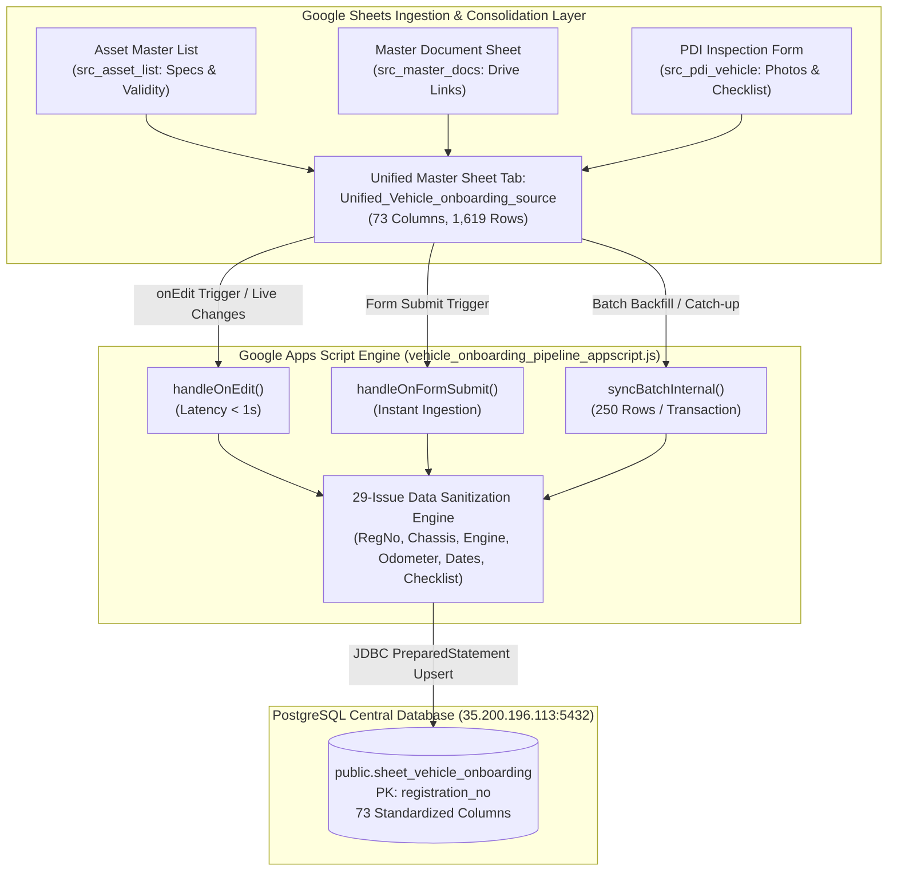

# LetzRyd Vehicle Onboarding Live Pipeline - Knowledge Transfer Documentation

Target Database: `35.200.196.113:5432`  
Database Name: `postgres`  
Target Table: `public.sheet_vehicle_onboarding`  
Source Spreadsheet: `Vehicle_Onboarding Table source`  
Source Sub-Sheets Merged: `src_asset_list`, `src_master_docs`, `src_pdi_vehicle`  
Target Master Sheet Tab: `Unified_Vehicle_onboarding_source` (73 Columns, 1,619 Rows)  
Technology Stack: Google Apps Script (JavaScript V8), PostgreSQL 14+, JDBC, PL/pgSQL  

---

## 1. Executive Summary & Overview

The **LetzRyd Vehicle Onboarding Live Pipeline** provides real-time data ingestion, multi-source consolidation, programmatic data sanitization, and structured persistence for the entire fleet across LetzRyd operating hubs (Bangalore, Hyderabad, Mumbai).

Operating fleet records originate across 3 disjoint functional operations:
1. **Asset Master List (`src_asset_list`)**: Core procurement specs, leasing partners, financier, and statutory validity dates (Cols 1–26).
2. **Master Document Repository (`src_master_docs`)**: Google Drive links for RC copies, fitness, permits, insurance policies, and tax receipts (Cols 27–40).
3. **PDI Physical Inspection Form (`src_pdi_vehicle`)**: Delivery odometer readings, battery/engine serial numbers, 360-degree vehicle inspection images, and equipment inventory (Cols 41–73).

This pipeline unifies all 3 sources into a **73-column master tabular model**, resolves all **29 cataloged data quality anomalies (`VEH-01` through `VEH-29`)**, and writes directly into PostgreSQL **`public.sheet_vehicle_onboarding`** with zero data loss.

### Primary System Guarantees
- **Zero Data Loss Rule**: 100% of the 1,619 vehicle fleet is preserved with full attribution. Legacy fleet records without digital PDI forms or missing invoices are preserved with clean nullable flags.
- **True Natural Primary Key**: Keyed on normalized uppercase alphanumeric **`registration_no`** (e.g. `KA05AP6032`), matching Column F (`vehicle_number (Plate)`), guaranteeing 100% unique entity resolution and idempotent `ON CONFLICT (registration_no) DO UPDATE` upserts.
- **Clean Sequential ID Alignment**: Internal PostgreSQL sequence `id BIGSERIAL` starts at **`1`** and ends at **`1,619`** (strictly continuous, matching `sl` entry index with 0 sequence jumps/gaps).
- **Sub-Second Live Synchronization**: Event-driven `handleOnEdit` and `handleOnFormSubmit` triggers propagate cell edits and form submissions to PostgreSQL in **< 1 second**.
- **Batch Processing Resilience**: Bulk backfills process in **250-row chunks** with transaction rollbacks (`conn.rollback()`), bypassing Apps Script execution timeouts.
- **Connection Leak-Proof**: Exhaustive `try-catch-finally` resource management ensuring all JDBC connections and prepared statements close gracefully under all failure modes.

---

## 2. High-Level Architecture & Data Flow



---

## 3. Directory Contents

| File | Description |
| :--- | :--- |
| [`vehicle_onboarding_pipeline_appscript.js`](./vehicle_onboarding_pipeline_appscript.js) | Production Google Apps Script code (~767 lines) featuring 73-column JDBC mapping, 29-issue data hygiene engine, 250-row batch chunking, and automated trigger handlers. |
| [`schema.sql`](./schema.sql) | PostgreSQL DDL definitions for `public.sheet_vehicle_onboarding`, primary key constraints, 7 performance B-Tree indexes, and operational verification queries. |
| [`data_issues.md`](./data_issues.md) | Comprehensive audit catalog of all 29 identified anomalies (`VEH-01` through `VEH-29`) and their programmatic transformation rules. |
| [`README.md`](./README.md) | Complete Knowledge Transfer (KT) document, system architecture, database schema, and operational runbook. |

---

## 4. PostgreSQL Database Schema DDL

```sql
-- ==============================================================================
-- LETZRYD VEHICLE ONBOARDING MASTER TABLE DDL
-- Target Table: public.sheet_vehicle_onboarding
-- Host: 35.200.196.113:5432 | DB: postgres
-- ==============================================================================

CREATE TABLE IF NOT EXISTS public.sheet_vehicle_onboarding (
    id BIGSERIAL PRIMARY KEY,
    registration_no VARCHAR(50) NOT NULL UNIQUE,

    -- Asset Specs & Registration (Cols 1-26)
    sl VARCHAR(100),
    city VARCHAR(100),
    registered_owner_name VARCHAR(255),
    chassis_no VARCHAR(100),
    engine_no VARCHAR(100),
    hp VARCHAR(100),
    dealer VARCHAR(255),
    model VARCHAR(255),
    vehicle_status VARCHAR(100),
    payment_date DATE,
    delivery_date DATE,
    gps VARCHAR(255),
    mfg_mm_yy VARCHAR(50),
    financier VARCHAR(255),
    ownership VARCHAR(100),
    registration_date DATE,
    ageing VARCHAR(100),
    rto_tax_validity DATE,
    permit_validity DATE,
    fitness_validity DATE,
    pollution_validity DATE,
    insurance_validity DATE,
    delivered_month_y VARCHAR(50),
    pdi_status VARCHAR(100),
    platform VARCHAR(100),

    -- Master Document Sheet (Cols 27-40)
    mds_timestamp TIMESTAMP WITH TIME ZONE,
    mds_email_address VARCHAR(255),
    mds_vehicle_number VARCHAR(100),
    registration_certificate TEXT,
    fitness TEXT,
    permit TEXT,
    insurance TEXT,
    pollution TEXT,
    letzryd_serial_number VARCHAR(100),
    insurance_endorsement TEXT,
    invoice_copy TEXT,
    front_photo TEXT,
    back_photo TEXT,
    comments TEXT,

    -- PDI Vehicle Inspection (Cols 41-73)
    pdi_timestamp TIMESTAMP WITH TIME ZONE,
    pdi_email_address VARCHAR(255),
    pdi_city VARCHAR(100),
    pdi_reg_no VARCHAR(100),
    received_or_allocated VARCHAR(100),
    engine_and_chasis_no TEXT,
    battery_sl_no VARCHAR(255),
    engine_compartment TEXT,
    vehicle_image_front TEXT,
    vehicle_image_lh TEXT,
    vehicle_image_back TEXT,
    vehicle_image_rh TEXT,
    kms_reading NUMERIC(10, 2),
    fast_tag_image_from_inside TEXT,
    music_system_image TEXT,
    key_quantity TEXT,
    rh_fr_tyre_brand_sl_no TEXT,
    lh_fr_tyre_brand_sl_no TEXT,
    rh_rear_tyre_brand_sl_no TEXT,
    lh_rear_tyre_brand_sl_no TEXT,
    spare_wheel_brand_sl_no TEXT,
    jack VARCHAR(50),
    jack_rod VARCHAR(50),
    spanner VARCHAR(50),
    parking_triangle VARCHAR(50),
    fire_extinguishers VARCHAR(50),
    seat_cover VARCHAR(50),
    floor_carpet VARCHAR(50),
    tracking_device_vendor VARCHAR(255),
    tracking_device_type VARCHAR(255),
    letzryd_unique_vehicle_no VARCHAR(100),
    cng_plate VARCHAR(255),
    cng_installation_date DATE,

    -- Pipeline Audit & Tracking Metadata
    sheet_row_number INTEGER,
    created_at TIMESTAMP WITH TIME ZONE DEFAULT CURRENT_TIMESTAMP,
    updated_at TIMESTAMP WITH TIME ZONE DEFAULT CURRENT_TIMESTAMP
);

-- Performance B-Tree Indexes
CREATE INDEX IF NOT EXISTS idx_veh_onb_reg_no ON public.sheet_vehicle_onboarding(registration_no);
CREATE INDEX IF NOT EXISTS idx_veh_onb_city ON public.sheet_vehicle_onboarding(city);
CREATE INDEX IF NOT EXISTS idx_veh_onb_status ON public.sheet_vehicle_onboarding(vehicle_status);
CREATE INDEX IF NOT EXISTS idx_veh_onb_chassis ON public.sheet_vehicle_onboarding(chassis_no);
CREATE INDEX IF NOT EXISTS idx_veh_onb_delivery_date ON public.sheet_vehicle_onboarding(delivery_date);
CREATE INDEX IF NOT EXISTS idx_veh_onb_owner ON public.sheet_vehicle_onboarding(registered_owner_name);
CREATE INDEX IF NOT EXISTS idx_veh_onb_fitness ON public.sheet_vehicle_onboarding(fitness_validity);
```

---

## 5. Summary of 29-Issue Standardization Engine

| Category | Issue Range | Key Standardizations Implemented |
| :--- | :--- | :--- |
| **Primary Key & Identity Engine** | `VEH-01`, `VEH-04`, `VEH-16`, `VEH-28` | Normalizes registration numbers using regex `UPPER(REPLACE(r"[^A-Za-z0-9]", ""))` (e.g. `KA05AP6032`); resolves internal serial collisions (`VEH-16`) by anchoring on registration number; auto-generates PostgreSQL sequential `id BIGSERIAL PRIMARY KEY`. |
| **Demographics & Canonical Text** | `VEH-02`, `VEH-03`, `VEH-06` to `VEH-10`, `VEH-14`, `VEH-21` | Standardizes city hubs (`Bangalore`, `Hyderabad`, `Mumbai`); cleans internal engine/chassis whitespace; maps literal tokens (`"Nil"`, `"SAM-Nil"`, `"-"`, `"NaN"`) to SQL `NULL`; standardizes vehicle lifecycle statuses (`Delivered`, `Sold`, `Underregistration`, `RFD - New`, `Total Loss`). |
| **Date & Statutory Validities** | `VEH-11`, `VEH-13`, `VEH-15`, `VEH-29` | Multi-format parser handles `DD/MM/YYYY`, `YYYY-MM-DD`, `MM/YYYY`, and Google Sheets serial integers; casts safely using `CAST(? AS date)` / `CAST(? AS timestamptz)` while handling valid nulls on pending registrations. |
| **Odometer & Metric Normalization** | `VEH-23` | Strips string suffixes (`"08km"`, `"12 kms"`) via regex `[^0-9.]` to extract clean numbers; stores as PostgreSQL `NUMERIC(10,2)` (Average: `45.34 km`). |
| **Physical Equipment Checklist** | `VEH-26` | Normalizes messy raw inputs (`"Y"`, `"1"`, `"available"`, `"Yes"`, `"No"`) into canonical `"Yes"` / `"No"` booleans across Jack, Spanner, Extinguisher, Seat Cover, and Carpet. |
| **Documents & Legacy Fleet Handling** | `VEH-17` to `VEH-20`, `VEH-22`, `VEH-24`, `VEH-25`, `VEH-27` | Preserves all Google Drive photo URLs; accommodates mixed Drive URLs in key quantities; preserves 304 pre-digital legacy vehicles with clean nullable flags under the Zero Data Loss policy. |

---

## 6. Deployment & Operations Runbook

### Step 1: Database Setup
Execute [`schema.sql`](./schema.sql) in PostgreSQL:
```bash
psql -h 35.200.196.113 -U postgres -d postgres -f schema.sql
```

### Step 2: Google Apps Script Setup
1. Open the master Google Sheet: [`Vehicle_Onboarding Table source`](https://docs.google.com/spreadsheets/d/19cZinutE-nQaFwFoSfGOx1kjP9lvFfEOI0s7_lYYCaU/edit?usp=sharing).
2. Go to **Extensions > Apps Script**.
3. Replace the contents of `Code.gs` with the code in [`vehicle_onboarding_pipeline_appscript.js`](./vehicle_onboarding_pipeline_appscript.js).
4. Press `Ctrl + S` to save as **`LetzRyd Vehicle Onboarding Pipeline`**.

### Step 3: Run Full Historical Ingestion
1. Refresh the spreadsheet. The custom menu **`LetzRyd Pipeline`** will appear in the top bar.
2. Click **`LetzRyd Pipeline > Test Database Connection`** to confirm PostgreSQL connectivity.
3. Click **`LetzRyd Pipeline > Sync Entire Sheet to Postgres`** (or **`Resume Sync (Rows 1000 to End)`** if resuming).
4. All **1,619 vehicles** will be committed in 250-row batches.

### Step 4: Activate Continuous Triggers
1. In the menu, click **`LetzRyd Pipeline > Install Automated Triggers`**.
2. Automated triggers installed:
   - **`handleOnEdit`**: Captures real-time single-cell edits and pushes to Postgres in **< 1s**.
   - **`handleOnFormSubmit`**: Instantly ingests new form submissions.
   - **`syncRecentVehicles`**: 15-minute background catch-up timer scanning recent rows.

---

## 7. Verification & Data Quality Audit Queries

```sql
-- 1. Check Total Synced Vehicles (Must be 1,619)
SELECT count(*) AS total_synced_vehicles 
FROM public.sheet_vehicle_onboarding;

-- 2. Primary Key Uniqueness & Integrity Audit
SELECT 
    COUNT(*) AS total_rows,
    COUNT(DISTINCT registration_no) AS unique_registration_nos,
    COUNT(CASE WHEN registration_no IS NULL OR TRIM(registration_no) = '' THEN 1 END) AS null_keys
FROM public.sheet_vehicle_onboarding;

-- 3. City Distribution & Normalization Audit
SELECT 
    city, 
    count(*) AS total_vehicles,
    ROUND(count(*) * 100.0 / SUM(count(*)) OVER(), 2) AS percentage
FROM public.sheet_vehicle_onboarding 
GROUP BY city 
ORDER BY total_vehicles DESC;

-- 4. Odometer Reading (kms_reading) Numeric Verification
SELECT 
    COUNT(kms_reading) AS cleaned_readings,
    MIN(kms_reading) AS min_kms,
    MAX(kms_reading) AS max_kms,
    ROUND(AVG(kms_reading), 2) AS average_kms
FROM public.sheet_vehicle_onboarding 
WHERE kms_reading IS NOT NULL;

-- 5. Physical Equipment Inventory Breakdown
SELECT 
    COUNT(CASE WHEN jack = 'Yes' THEN 1 END) AS vehicles_with_jack,
    COUNT(CASE WHEN spanner = 'Yes' THEN 1 END) AS vehicles_with_spanner,
    COUNT(CASE WHEN fire_extinguishers = 'Yes' THEN 1 END) AS vehicles_with_extinguisher
FROM public.sheet_vehicle_onboarding;

-- 6. Sample Live Data Inspection (10 Synced Vehicles)
SELECT 
    id, registration_no, city, registered_owner_name, model, 
    vehicle_status, delivery_date, kms_reading, updated_at
FROM public.sheet_vehicle_onboarding 
ORDER BY id ASC 
LIMIT 10;
```

---

## 8. Maintenance, Error Handling & Recovery

1. **Upsert Idempotency**:
   - Every database transaction uses PostgreSQL `ON CONFLICT (registration_no) DO UPDATE SET ...`, preventing duplicate rows or sequence thrashing.
2. **Failure Rollback**:
   - If any row within a 250-row batch has a fatal formatting error, `conn.rollback()` ensures the transaction aborts cleanly without corrupting existing database state.
3. **Trigger Management**:
   - If triggers need to be reinstalled or cleaned up, use **`LetzRyd Pipeline > Remove Automated Triggers`** followed by **`Install Automated Triggers`**.
