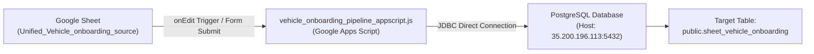

# LetzRyd Vehicle Onboarding Live Data Pipeline

Centralized live data ingestion pipeline bridging Google Sheets (`Vehicle_Onboarding Table source` -> tab `Unified_Vehicle_onboarding_source`) with the central PostgreSQL database (`public.sheet_vehicle_onboarding`).

---

## 1. Pipeline Architecture



---

## 2. Target Database Details

* **Database Engine**: PostgreSQL 14+
* **Host**: `35.200.196.113`
* **Port**: `5432`
* **Database**: `postgres`
* **Schema**: `public`
* **Target Table**: `public.sheet_vehicle_onboarding`
* **Primary Key**: `registration_no` (Unique alphanumeric 10-char plate)

---

## 3. Repository Structure

```
📁 Vehicle Onboarding Google Sheet/
├── 📄 schema.sql                               # PostgreSQL table DDL & performance B-Tree indexes
├── 📄 vehicle_onboarding_pipeline_appscript.js  # Live Google Apps Script pipeline (Real-time DB sync & onEdit)
├── 📄 data_issues.md                           # Complete catalog of all 29 anomalies & standardization rules
└── 📄 README.md                                # Setup, triggers, and pipeline documentation
```

---

## 4. Key Pipeline Features

1. **Real-Time Live Synchronization**:
   * Uses `handleOnEdit()` and `handleOnFormSubmit()` triggers to immediately upsert modified or newly inserted rows into PostgreSQL.
2. **Zero Data Loss Guarantee**:
   * Ingests all 73 columns without dropping any vehicle records. Legacy vehicles without PDI records or missing invoices are preserved with clean nullable flags.
3. **Multi-Row Paste Resilience**:
   * Processes batch updates in chunks of 50 rows with automated transaction management (`conn.commit()` / `conn.rollback()`).
4. **Data Normalization & Sanitization**:
   * Automatically uppercases registration numbers (`ka05ap7501` -> `KA05AP7501`) and strips hyphens and stray whitespace.
   * Strips `"km"` suffixes from odometer entries (`"08km"` -> `8.0`).
   * Normalizes equipment checklist booleans (`Yes`/`No`).
5. **Connection Leak Prevention**:
   * Full `try-catch-finally` lifecycle management ensuring all JDBC connections and prepared statements are safely closed.

---

## 5. Google Apps Script Setup & Installation

### Step 1: Open Apps Script
1. Open the master Google Sheet: [`Vehicle_Onboarding Table source`](https://docs.google.com/spreadsheets/d/19cZinutE-nQaFwFoSfGOx1kjP9lvFfEOI0s7_lYYCaU/edit?usp=sharing).
2. In the top menu, go to **Extensions > Apps Script**.

### Step 2: Paste the Pipeline Code
1. Delete any default code in `Code.gs`.
2. Copy and paste the entire contents of [`vehicle_onboarding_pipeline_appscript.js`](./vehicle_onboarding_pipeline_appscript.js).
3. Save the project as **`LetzRyd Vehicle Onboarding Pipeline`**.

### Step 3: Test & Initialize
1. Refresh the Google Sheet. A new menu **`LetzRyd Pipeline`** will appear in the top toolbar.
2. Click **`LetzRyd Pipeline > Test Database Connection`** to verify live connectivity to PostgreSQL.
3. Click **`LetzRyd Pipeline > Install Automated Triggers`** to activate real-time `onEdit` and 15-minute catch-up sync.
4. Click **`LetzRyd Pipeline > Sync Entire Sheet to Postgres`** to perform the initial full sync of all 1,619 vehicles.

---

## 6. Verification Queries

```sql
-- 1. Check total rows synced
SELECT count(*) FROM public.sheet_vehicle_onboarding;

-- 2. Inspect sample synced vehicle
SELECT registration_no, city, registered_owner_name, model, vehicle_status, delivery_date, kms_reading
FROM public.sheet_vehicle_onboarding
ORDER BY id ASC
LIMIT 10;

-- 3. Check statutory compliance summary
SELECT 
    city,
    count(*) as total_vehicles,
    count(fitness_validity) as fitness_recorded,
    count(insurance_validity) as insurance_recorded
FROM public.sheet_vehicle_onboarding
GROUP BY city;
```
