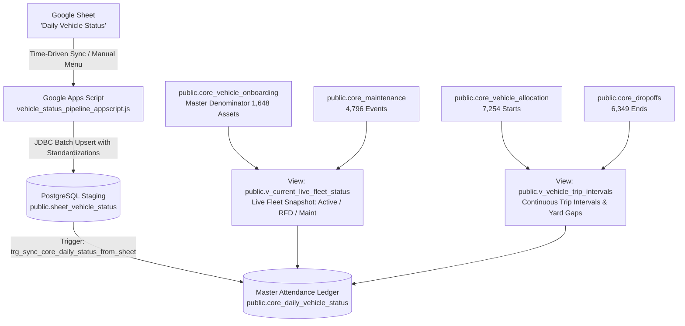

# LetzRyd Vehicle Status Google Sheet Pipeline & PostgreSQL Master Ingestion

Real-time and batch synchronization engine bridging daily vehicle operational state tracking from Google Sheets (`Daily Vehicle Status` tab in `Vehicle Status List V3.xlsx`) into the centralized production PostgreSQL database (`public.sheet_vehicle_status` and `public.core_daily_vehicle_status`).

---

## Architecture Overview



---

## Key Guarantees & Architectural Highlights

1. **Self-Contained Real-Time Ingestion**:
   - Google Apps Script ingests raw vehicle status records directly into `public.sheet_vehicle_status`.
   - Native PostgreSQL database trigger `trg_sync_core_daily_status_from_sheet` immediately synchronizes records into `public.core_daily_vehicle_status` in `<10ms` without requiring any external cron jobs or Python scripts.

2. **Strict 3 Priority Precedence Rules**:
   - **Priority 1 (Maintenance Override)**: Active workshop job cards in `core_maintenance` or recent Repair & Maintenance drop-offs override driver custody $\rightarrow$ Status: `Maintenance`, Cohort: `Off Road`, `billable_rent_day = FALSE`.
   - **Priority 2 (Active Trip Interval)**: Open driver allocation in `v_vehicle_trip_intervals` $\rightarrow$ Status: `Active`, Cohort: `On Road`, `billable_rent_day = TRUE`.
   - **Priority 3 (Yard Default)**: Vehicles without active drivers or workshop jobs $\rightarrow$ Status: `RFD`, Cohort: `In Yard`, `billable_rent_day = FALSE`.

3. **Mathematical Denominator Integrity**:
   - $\text{Active Trips (1,192)} + \text{Yard/Workshop Gap (456)} = \mathbf{1,648\text{ Fleet Denominator}}$.
   - Inverted Date Errors: **0 (Zero Tolerance)**.

4. **Zero-Burn Sequence ID CTE Query**:
   - Uses CTE upsert syntax to update existing natural keys `(status_date, vehicle_number)` in place without burning auto-increment sequence IDs.

5. **Pure IST Timestamp Contract**:
   - All audit timestamps stored as `TIMESTAMP WITHOUT TIME ZONE` in Indian Standard Time (`Asia/Kolkata`).

---

## Target Database Schema Objects

- **Host**: `35.200.196.113:5432`
- **Database**: `postgres`
- **Staging Table**: `public.sheet_vehicle_status`
- **Master Ledger Table**: `public.core_daily_vehicle_status`
- **Interval Pairing View**: `public.v_vehicle_trip_intervals`
- **Real-Time Live Fleet View**: `public.v_current_live_fleet_status`
- **Daily Ledger Procedure**: `public.sp_generate_daily_vehicle_status(IN p_target_date DATE)`
- **Live Ingestion Trigger**: `trg_sync_core_daily_status_from_sheet` on `public.sheet_vehicle_status`

---

## Deployment & Verification Instructions

### 1. Database DDL
Run [`schema.sql`](./schema.sql) on the production PostgreSQL database:
```bash
psql -h 35.200.196.113 -U postgres -d postgres -f schema.sql
```

### 2. Google Apps Script Setup
1. Open the target Google Sheet.
2. Go to **Extensions** $\to$ **Apps Script**.
3. Paste the entire code from [`vehicle_status_pipeline_appscript.js`](./vehicle_status_pipeline_appscript.js).
4. Save the project (`Ctrl+S`).
5. Reload the Google Sheet and use the custom menu **`LetzRyd Vehicle Status Sync`**:
   - Click **1. Test Database Connection** to complete the one-time authorization.
   - Click **3. Sync Entire Sheet (Batch 200)** for initial backfill.
   - Click **4. Install Automated 1-Min Trigger** to enable automatic background sync every 1 minute.

### 3. Verification Queries
```sql
-- 1. Verify staging and core ledger row counts
SELECT COUNT(*) AS total_staging_rows FROM public.sheet_vehicle_status;
SELECT COUNT(*) AS total_core_ledger_rows FROM public.core_daily_vehicle_status;

-- 2. View real-time live fleet status breakdown
SELECT live_status, live_cohort, COUNT(*) AS vehicle_count,
       ROUND(100.0 * COUNT(*) / SUM(COUNT(*)) OVER (), 2) AS pct_of_fleet
FROM public.v_current_live_fleet_status
GROUP BY live_status, live_cohort
ORDER BY vehicle_count DESC;

-- 3. City-wise operational distribution
SELECT city, live_status, COUNT(*) AS count
FROM public.v_current_live_fleet_status
GROUP BY city, live_status
ORDER BY city, count DESC;
```
