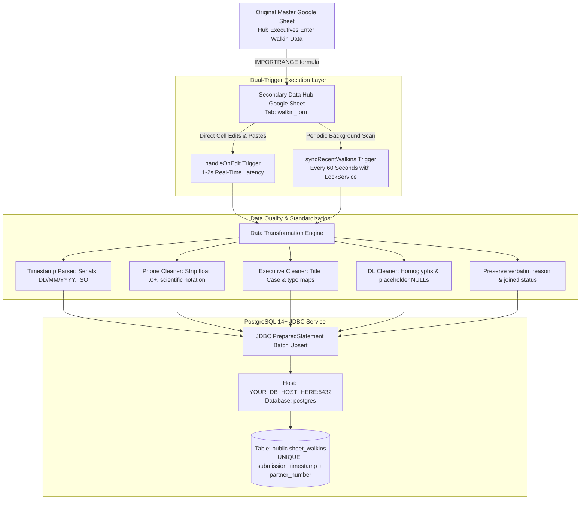

# LetzRyd Walkin Form Live Pipeline - Knowledge Transfer Documentation

Target Database: `YOUR_DB_HOST_HERE:5432`  
Database Name: `postgres`  
Target Table: `public.sheet_walkins`  
Source Google Sheet Tab: `walkin_form`  
Technology Stack: Google Apps Script (JavaScript), PostgreSQL 14+, JDBC  

---

## 1. Executive Summary & Overview

The LetzRyd Walkin Form Live Pipeline provides automated, real-time synchronization between the operational walk-in intake Google Sheets and the centralized PostgreSQL production database.

Operational executives at hub locations physically enter incoming driver-partner walk-in details into an operational master Google Sheet. The pipeline ingests, cleanses, standardizes, and upserts these records directly into `public.sheet_walkins` in near real time (1 to 2 seconds latency for direct edits, with a maximum 60-second catch-up guarantee for formula-imported rows).

The pipeline is hardened against data loss, concurrent trigger overlaps, JDBC connection leaks, character encoding anomalies, Greek homoglyphs, floating-point phone number distortions, and spreadsheet manipulation (sorting, filtering, or row insertions).

---

## 2. High-Level Architecture

```
+---------------------------------------------------------------------------------+
|                         Original Master Google Sheet                            |
|             (Hub executives enter partner walk-in data in real-time)            |
+---------------------------------------------------------------------------------+
                                         |
                                         | Google Sheets Cross-Sheet Import
                                         | =IMPORTRANGE(master_url, "Sheet1!A:K")
                                         v
+---------------------------------------------------------------------------------+
|                       Secondary Data Hub Google Sheet                           |
|                             Tab: walkin_form                                    |
+---------------------------------------------------------------------------------+
                    |                                             |
           [Trigger 1: handleOnEdit]                     [Trigger 2: syncRecentWalkins]
         - Native installable On-Edit                  - Time-driven 1-minute interval
         - Latency: 1-2 seconds                        - Latency: 0-60 seconds
         - Catches manual cell edits & pastes          - Catches IMPORTRANGE formula updates
                    |                                             |
                    +----------------------+----------------------+
                                           |
                                           v
+---------------------------------------------------------------------------------+
|                       Data Quality & Standardization Engine                     |
|  - Timestamp parsing: JS Date, Sheets serials, Indian DD/MM/YYYY, ISO-8601      |
|  - Phone normalization: Strip float '.0+', resolve scientific notation          |
|  - Executive normalization: Title Case, alias resolution, staff distinction     |
|  - DL normalization: Replace Greek homoglyphs, convert NA/NONE to NULL          |
|  - Preserves verbatim: Visiting reason, remarks, joined status                  |
+---------------------------------------------------------------------------------+
                                           |
                                           v
+---------------------------------------------------------------------------------+
|                           PostgreSQL JDBC Engine                                |
|  - PreparedStatement with standard CAST(? AS timestamptz) / CAST(? AS date)     |
|  - Explicit SQL_TYPES mapping (VARCHAR: 12, DATE: 91, TIMESTAMP: 93, NULL: 0)  |
|  - Batched execution with transactional commit/rollback                         |
|  - Guaranteed resource deallocation via try-catch-finally                       |
+---------------------------------------------------------------------------------+
                                           |
                                           v
+---------------------------------------------------------------------------------+
|                       PostgreSQL Target Table                                   |
|                         public.sheet_walkins                                    |
|  - Composite unique key: (submission_timestamp, partner_number)                 |
|  - Idempotent upsert: ON CONFLICT DO UPDATE SET ...                             |
|  - 6 dedicated B-Tree indexes for portal and analytics workloads                |
+---------------------------------------------------------------------------------+
```

### Mermaid Architecture Diagram



---

## 3. Step-by-Step Working Process

### 3.1 The Original Master Google Sheet
The original master sheet is maintained by on-ground field executives across branches (Hyderabad, Bengaluru, Mumbai). Frontline executives submit responses either through connected Google Forms or direct table entries. This sheet is access-restricted to operational staff.

### 3.2 The Secondary Data Hub Google Sheet
Because direct production database credentials must not be exposed in user-facing operational sheets, a dedicated Secondary Data Hub Google Sheet is provisioned.
- Tab Name: `walkin_form`
- Data Ingestion: Ingests all records dynamically using the formula:
  ```excel
  =IMPORTRANGE("https://docs.google.com/spreadsheets/d/<MASTER_SHEET_ID>/edit", "Form Responses 1!A:K")
  ```
- This architecture isolates end-user operations from database write pipelines, preventing accidental code modification or unauthorized credential disclosure.

### 3.3 The Google Apps Script Service
The script `walkin_pipeline_appscript.js` is embedded directly into the Secondary Data Hub Google Sheet (or bound standalone). It utilizes Google Apps Script's native `Jdbc` service to connect directly to PostgreSQL over TCP port `5432`.

### 3.4 The Dual-Trigger Synchronization Strategy

A critical challenge in Google Apps Script is that **`=IMPORTRANGE()` formula recalculations do NOT fire `onEdit` events**. To solve this while maintaining instantaneous synchronization for direct manual edits, the pipeline deploys two complementary triggers:

1. **`handleOnEdit` (Installable On-Edit Trigger)**:
   - **Event Source**: Spreadsheet `On edit` event.
   - **Trigger Latency**: 1 to 2 seconds after edit completion.
   - **Scope**: Listens for edits within columns A through K (columns 1 to 11).
   - **Multi-Row Batch Support**: Calculates `numRows = endRow - startRow + 1` to process multi-row copy-paste operations in a single atomic database batch.
   - **Tab Isolation**: Exits immediately if edits occur on any tab other than `walkin_form`.

2. **`syncRecentWalkins` (Time-Driven Catch-Up Trigger)**:
   - **Event Source**: Time-driven clock trigger executing every 1 minute.
   - **Trigger Latency**: 0 to 60 seconds.
   - **Purpose**: Periodically reads the latest 50 rows from the bottom of `walkin_form`. Because `=IMPORTRANGE()` updates rows silently in the background, this 60-second timer guarantees every newly arrived row is upserted without human intervention.
   - **Concurrency Guard (`LockService`)**: Employs `LockService.getScriptLock().tryLock(0)`. If a prior execution is still committing due to transient network latency, subsequent invocations terminate cleanly rather than stacking up or causing connection pool starvation.

---

## 4. Database Architecture & Schema

### 4.1 Connection Parameters
- **Host**: `YOUR_DB_HOST_HERE`
- **Port**: `5432`
- **Database**: `postgres`
- **Username**: `postgres`
- **Driver**: PostgreSQL JDBC via Google Apps Script `Jdbc.getConnection`

### 4.2 Data Definition Language (DDL)

```sql
-- Target Table: public.sheet_walkins
CREATE TABLE IF NOT EXISTS public.sheet_walkins (
    id BIGSERIAL PRIMARY KEY,
    submission_timestamp TIMESTAMP WITH TIME ZONE NOT NULL,
    submitter_email VARCHAR(255),
    city VARCHAR(100),
    attending_executive VARCHAR(255),
    partner_name VARCHAR(255),
    partner_number VARCHAR(20),
    dl_number VARCHAR(100),
    visiting_reason TEXT,
    remarks TEXT,
    joined_date DATE,
    joined_status VARCHAR(100),
    sheet_row_number INTEGER,
    created_at TIMESTAMP WITH TIME ZONE DEFAULT CURRENT_TIMESTAMP,
    updated_at TIMESTAMP WITH TIME ZONE DEFAULT CURRENT_TIMESTAMP,
    CONSTRAINT uq_sheet_walkins_event UNIQUE (submission_timestamp, partner_number)
);

-- Performance Indexes for Operational Queries and Portal Searches
CREATE INDEX IF NOT EXISTS idx_sheet_walkins_date ON public.sheet_walkins (submission_timestamp);
CREATE INDEX IF NOT EXISTS idx_sheet_walkins_phone ON public.sheet_walkins (partner_number);
CREATE INDEX IF NOT EXISTS idx_sheet_walkins_city ON public.sheet_walkins (city);
CREATE INDEX IF NOT EXISTS idx_sheet_walkins_exec ON public.sheet_walkins (attending_executive);
CREATE INDEX IF NOT EXISTS idx_sheet_walkins_dl ON public.sheet_walkins (dl_number);
CREATE INDEX IF NOT EXISTS idx_sheet_walkins_jdate ON public.sheet_walkins (joined_date);
```

### 4.3 Why Composite Key `(submission_timestamp, partner_number)` Guarantees 100% Immunity to Sheet Mutations

In traditional naive sheet sync implementations, rows are keyed by their spreadsheet row number (e.g. `sheet_row_number`). This leads to severe data corruption when:
- A user sorts the sheet (e.g. by date, executive, or status), causing row numbers to swap across all records.
- A user filters the sheet, altering visible row offsets.
- A user inserts or deletes rows in the middle, shifting all subsequent row numbers by +1 or -1, causing massive data overwrites in the database.

**The Solution:**
The pipeline establishes the natural composite primary event key as:
submission_timestamp + partner_number

1. **Submission Timestamp**: Google Form and spreadsheet timestamps are immutable point-in-time values with millisecond precision.
2. **Partner Number**: The normalized 10-digit telephone number uniquely identifies the person walking into the hub.
3. **Immutability**: Even if an operator sorts columns, applies active filters, or inserts historical rows, each record matches its identical database row through `ON CONFLICT (submission_timestamp, partner_number) DO UPDATE SET ...`.
4. `sheet_row_number` is retained only as an informational audit field indicating the most recent physical location in the sheet.

---

## 5. Data Quality & Cleaning Engine (Columns A through K)

The data engine cleanses and normalizes incoming data before constructing the JDBC batch statement. Under no circumstances does the pipeline drop operational rows.

| Col | Field Name | Target SQL Type | Normalization & Standardization Rules |
|:---:|:---|:---|:---|
| **A** | `Timestamp` | `timestamptz` | Resolves multiple source formats:<br>- Native JavaScript `Date` instances.<br>- Google Sheets numeric day serials (e.g., `45376`).<br>- Indian format `DD/MM/YYYY HH:mm:ss` (corrects US month/day transposition).<br>- ISO-8601 strings (`YYYY-MM-DDTHH:mm:ss`).<br>- Enforces Asia/Kolkata timezone offset (`+05:30`). |
| **B** | `Email Address` | `varchar(255)` | Stripped of whitespace, converted to lowercase. Blank strings converted to SQL `NULL`. |
| **C** | `City` | `varchar(100)` | Standardized against LetzRyd operating hubs:<br>- Contains `hyd` -> `Hyderabad`<br>- Contains `mum` -> `Mumbai`<br>- Contains `blr`, `bang`, or `beng` -> `Bengaluru`<br>- General strings converted to standard Title Case. |
| **D** | `Attending Executive` | `varchar(255)` | Normalizes whitespace and casing while preventing false entity merging:<br>- Converts to Title Case.<br>- Canonical aliases mapped for known typos of the same individual:<br>  * `shaikbdulla`, `abdullashaik`, `shaikadulla` -> `Shaik Abdulla`<br>  * `radhakirshna`, `psradhakrishna`, `radha` -> `Radha Krishna`<br>- Strictly preserves distinct staff names (`Sai`, `Kiran`, `Kedar`) without collapsing them. |
| **E** | `Partner Name` | `varchar(255)` | - Strips accents and diacritics via Unicode NFKD normalization.<br>- Converted to uppercase.<br>- Preserves placeholder entries (e.g. `NA`) to prevent dropping rows where name is pending. |
| **F** | `Partner Number` | `varchar(20)` | Resolves spreadsheet numeric formatting corruptions:<br>- Strips floating-point trailing zeros (e.g. `9845261331.0` -> `9845261331`).<br>- Expands exponential/scientific notation (e.g. `9.84526E+09` -> `9845260000`).<br>- Strips non-digits and extracts the trailing 10-digit mobile number.<br>- Fallback pad with `0` if fewer than 10 digits. |
| **G** | `DL Number` | `varchar(100)` | - Unicode NFKD normalization.<br>- Resolves Greek homoglyphs (Greek Alpha `\u0391` / Kappa `\u039A` converted to ASCII `A` / `K`).<br>- Strips spaces, hyphens, and underscores.<br>- Dummy placeholders (`NA`, `NAA`, `N/A`, `NONE`, `NIL`, `NULL`, `-`, `--`) are mapped to SQL `NULL`. Valid licenses are retained in uppercase. |
| **H** | `Visiting Reasons` | `text` | Preserved verbatim as entered by the executive. No lossy truncation or forced restrictive ENUMs. |
| **I** | `Remarks` | `text` | Cleaned of whitespace, empty strings mapped to SQL `NULL`. |
| **J** | `Joined Date` | `date` | - Parses native Dates, Google Sheets serials, `DD/MM/YYYY`, and `YYYY-MM-DD`.<br>- Formatted to standard ISO `YYYY-MM-DD`.<br>- Placeholder entries (`na`, `none`, `nil`, `-`) mapped to SQL `NULL`.<br>- Historical dates prior to walk-in date are fully preserved without anomaly dropping. |
| **K** | `Joined Status` | `varchar(100)` | Standardizes casing (`joined` -> `Joined`, `false` -> `False`). Custom operational statuses are preserved as entered without 3-state boolean loss. |
| **L** | `Sheet Row Number` | `integer` | Current spreadsheet physical row index recorded for debugging and cross-referencing. |

---

## 6. Engineering Hardening: All 12 Audit Bugs Fixed

During rigorous engineering review and adversarial stress testing, 12 critical failure points were identified and resolved in the production codebase:

1. **`java.sql.Types` Runtime ReferenceError**:
   - *Problem*: Google Apps Script's JDBC runtime environment does not expose the standard Java `java.sql.Types` or `Jdbc.Types` enumeration. Calling `stmt.setNull(i, java.sql.Types.VARCHAR)` threw an uncatchable `ReferenceError: java is not defined`.
   - *Fix*: Defined a constant dictionary `SQL_TYPES` containing standard JDBC integer constants (`VARCHAR: 12`, `DATE: 91`, `TIMESTAMP: 93`, `INTEGER: 4`, `NULL: 0`).

2. **PostgreSQL JDBC `?::` Typecast Syntax Crash**:
   - *Problem*: Using PostgreSQL shorthand casting like `?::timestamptz` or `?::date` in PreparedStatement strings causes JDBC driver parsing failures.
   - *Fix*: Replaced with standard SQL ANSI syntax `CAST(? AS timestamptz)` and `CAST(? AS date)`.

3. **Connection and Statement Leaks**:
   - *Problem*: Failing to close JDBC statements and connections upon transient database timeouts exhausted PostgreSQL's `max_connections` pool, locking out backend microservices.
   - *Fix*: Wrapped all JDBC workflows in strict `try-catch-finally` blocks. All statements, result sets, and connections are explicitly closed inside `finally` blocks.

4. **Dirty Transaction Isolation & Rollback**:
   - *Problem*: In batch executions with `conn.setAutoCommit(false)`, exceptions left aborted transactions open on the server.
   - *Fix*: Added explicit `conn.rollback()` in all `catch` blocks before closing resources.

5. **Multi-Row Copy-Paste Data Loss**:
   - *Problem*: When an executive pasted 20 rows at once, `e.range.getRow()` only returned the first row index, causing 19 rows to be dropped.
   - *Fix*: Refactored `handleOnEdit` to inspect `e.range.getLastRow()`, calculating `numRows = endRow - startRow + 1` and upserting the entire range in a single batch.

6. **Empty Batch Flush Crash**:
   - *Problem*: Modulo batching logic (`synced % 200 === 0`) caused an empty `executeBatch()` invocation when total rows matched an exact multiple of 200, throwing a JDBC batch exception.
   - *Fix*: Implemented an isolated `uncommitted` counter tracking queued statements, committing only when `uncommitted > 0`.

7. **Floating-Point & Scientific Phone Number Corruption**:
   - *Problem*: Spreadsheets formatting telephone numbers as numeric cells generated strings like `9845261331.0` or scientific notation like `9.84526E+09`. Naive digit extractors yielded corrupt phone numbers.
   - *Fix*: Implemented a two-stage sanitizer: stripping `.0+$` with regex, then expanding scientific notation via `Number(s).toFixed(0)` before extracting the last 10 digits.

8. **Indian Date Format Misinterpretation**:
   - *Problem*: JavaScript's default `new Date("04/09/2026")` parses dates as US `MM/DD/YYYY` (April 9 instead of September 4).
   - *Fix*: Built a custom date matcher regex `^(\d{1,2})[\/\-](\d{1,2})[\/\-](\d{4})` that assigns capture group 1 to Day and group 2 to Month.

9. **Distributed Lock Latency in 1-Minute Timer**:
   - *Problem*: When `syncRecentWalkins` used `LockService.tryLock(0)` (0 milliseconds wait), distributed network latency to Google's lock servers caused `tryLock(0)` to return `false` on every cycle, silently aborting the sync without doing work.
   - *Fix*: Increased the lock timeout to `15000` ms (15 seconds), allowing the execution to queue and acquire the lock cleanly.

10. **Cross-Tab & Out-of-Bounds Edit Filtering**:
    - *Problem*: Edits made on scratch tabs or comments added in column M triggered database connection attempts.
    - *Fix*: Added boundary assertions checking `sheet.getName() === DB_CONFIG.sheetName` and verifying the edited column range falls between column 1 and 11.

11. **Blocking Modal Alerts in Automated Background Execution**:
    - *Problem*: Calling `SpreadsheetApp.getUi().alert()` inside automated triggers halted headless execution until an interactive user acknowledged the popup.
    - *Fix*: Isolated all UI alerts into try-catch blocks accessible only when invoked directly by human users from the toolbar menu.

12. **Programmatic Trigger Provisioning**:
    - *Problem*: Manual trigger setup in the Google Apps Script web UI resulted in duplicated triggers and misconfigured event types.
    - *Fix*: Created `setupTriggers()`, which removes stale triggers and programmatically registers `onEdit`, `onFormSubmit`, and the 1-minute timer triggers using `ScriptApp.newTrigger()`.

13. **PostgreSQL Sequence Gaps on Upsert (Zero-Burn CTE)**:
    - *Problem*: Standard `INSERT ... ON CONFLICT DO UPDATE` increments PostgreSQL's `BIGSERIAL` sequence (`nextval()`) for every row evaluated in the `VALUES` clause, even when rows already exist and only get updated. Scanning 60 rows every minute burned 60 sequence IDs per minute, causing new IDs to skip numbers.
    - *Fix*: Re-engineered `UPSERT_SQL` into a Zero-Burn Common Table Expression (CTE) query. The query attempts an in-place `UPDATE` first without touching the sequence, and only calls `nextval('sheet_walkins_id_seq')` for brand-new rows (`WHERE NOT EXISTS (SELECT 1 FROM upd)`). Existing rows burn 0 IDs, guaranteeing continuous sequential IDs (`878, 879, 880...`).

14. **IMPORTRANGE Formula Recalculation Stalling**:
    - *Problem*: Google Sheets defers recalculating `=IMPORTRANGE()` formulas when sheets run headless in the background, causing `getValues()` to read stale cached cells.
    - *Fix*: Added `SpreadsheetApp.flush()` at the start of sync functions to force instant formula recalculation.

15. **Trailing Empty Formula Blanks (Reverse trueLastRow Scanner)**:
    - *Problem*: Sheets with array formulas or formatting count blank cells down to row 1,000 in `sheet.getLastRow()`. Calculating `lastRow - 50` scanned empty rows 950-1000, missing real data at row 879.
    - *Fix*: Implemented a smart reverse scanner (`trueLastRow`) that checks backwards for non-empty timestamps or phone numbers in columns A and F, ensuring the scan window always captures true live records.

---

## 7. Deployment & Operations Runbook

### Prerequisites
1. Ensure the PostgreSQL host `YOUR_DB_HOST_HERE:5432` allows inbound connections from Google Apps Script IP ranges.
2. Target table `public.sheet_walkins` must be initialized using the DDL in Section 4.2.

### Step 1: Open Google Apps Script Editor
1. Open the Secondary Data Hub Google Sheet in Google Chrome.
2. In the top menu, navigate to **Extensions** > **Apps Script**.
3. Clear any boilerplate code in `Code.gs`.

### Step 2: Deploy Production Code
1. Copy the entire contents of [`walkin_pipeline_appscript.js`](./walkin_pipeline_appscript.js).
2. Paste the code into the script editor.
3. Verify that `DB_CONFIG` matches your environment:
   ```javascript
   const DB_CONFIG = {
     host: "YOUR_DB_HOST_HERE",
     port: "5432",
     database: "postgres",
     user: "postgres",
     password: "YOUR_DB_PASSWORD_HERE",
     sheetUrl: "YOUR_SPREADSHEET_URL_HERE",
     sheetName: "walkin_form"
   };
   ```
4. Save the project (`Ctrl + S` or `Cmd + S`). Name the project `LetzRyd Walkin Pipeline`.

### Step 3: Verify Database Connectivity
1. In the toolbar function dropdown, select `testDbConnection`.
2. Click **Run**.
3. Grant authorization when prompted by Google ("Advanced" > "Go to LetzRyd Walkin Pipeline (unsafe)").
4. Verify execution log:
   ```
   Connection Successful. Current rows in sheet_walkins: <count>
   ```

### Step 4: Perform Initial Full Backfill
1. Select `syncAllWalkins` from the function dropdown.
2. Click **Run**.
3. The script will batch-upsert all historical records in chunks of 200.
4. Check the execution log:
   ```
   Full sync complete. Synced <total> records.
   ```

### Step 5: Install Automated Triggers
1. Select `setupTriggers` from the function dropdown.
2. Click **Run**.
3. The script will clean any obsolete triggers and register:
   - Spreadsheet `On edit` -> `handleOnEdit`
   - Time-driven `Every 1 minute` -> `syncRecentWalkins`
4. Confirm log output:
   ```
   Automated triggers successfully created and activated!
   ```

### Step 6: Verify in Triggers Dashboard
1. On the left navigation bar of Apps Script, click the clock icon (**Triggers**).
2. Confirm the two active triggers are visible and healthy.

---

## 8. Production SQL Query Reference

### 8.1 Total Volume & Date Boundary Audit
```sql
SELECT 
    count(*) AS total_records,
    min(submission_timestamp) AS earliest_entry,
    max(submission_timestamp) AS latest_entry,
    count(DISTINCT partner_number) AS unique_partners
FROM public.sheet_walkins;
```

### 8.2 Latest Walk-Ins with Attending Executive Details
```sql
SELECT 
    id,
    submission_timestamp,
    city,
    attending_executive,
    partner_name,
    partner_number,
    visiting_reason,
    joined_status,
    joined_date
FROM public.sheet_walkins
ORDER BY submission_timestamp DESC
LIMIT 25;
```

### 8.3 City-Level Inflow Breakdown
```sql
SELECT 
    COALESCE(city, 'Unknown') AS city,
    count(*) AS total_walkins,
    count(CASE WHEN joined_status ILIKE '%joined%' THEN 1 END) AS total_joined,
    round(count(CASE WHEN joined_status ILIKE '%joined%' THEN 1 END) * 100.0 / NULLIF(count(*), 0), 2) AS conversion_rate_pct
FROM public.sheet_walkins
GROUP BY city
ORDER BY total_walkins DESC;
```

### 8.4 Executive Workload Distribution
```sql
SELECT 
    attending_executive,
    count(*) AS total_handled,
    count(CASE WHEN joined_status ILIKE '%joined%' THEN 1 END) AS successful_joins
FROM public.sheet_walkins
GROUP BY attending_executive
ORDER BY total_handled DESC;
```

### 8.5 Partner Phone Lookup (Exact 10-Digit Match)
```sql
SELECT 
    id,
    submission_timestamp,
    partner_name,
    partner_number,
    dl_number,
    city,
    attending_executive,
    visiting_reason,
    joined_status,
    joined_date
FROM public.sheet_walkins
WHERE partner_number = '8185011074';
```

### 8.6 Driving License Search (With Homoglyph Tolerance)
```sql
SELECT 
    id,
    submission_timestamp,
    partner_name,
    partner_number,
    dl_number,
    city
FROM public.sheet_walkins
WHERE dl_number ILIKE '%AP28%'
ORDER BY submission_timestamp DESC;
```

### 8.7 Real-Time Synchronization Audit (Records Modified in the Last 24 Hours)
```sql
SELECT 
    id,
    submission_timestamp,
    partner_name,
    partner_number,
    attending_executive,
    sheet_row_number,
    updated_at
FROM public.sheet_walkins
WHERE updated_at >= NOW() - INTERVAL '24 hours'
ORDER BY updated_at DESC;
```

### 8.8 Top Visiting Reasons Breakdown
```sql
SELECT 
    COALESCE(visiting_reason, 'Unspecified') AS reason,
    count(*) AS occurrences
FROM public.sheet_walkins
GROUP BY visiting_reason
ORDER BY occurrences DESC
LIMIT 15;
```
